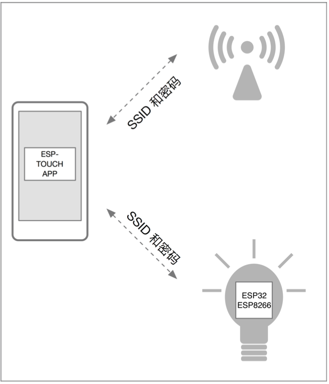
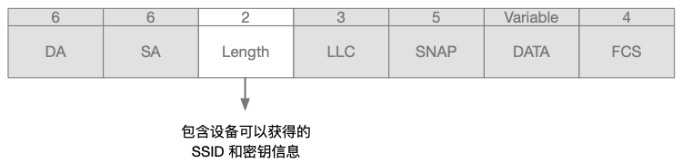
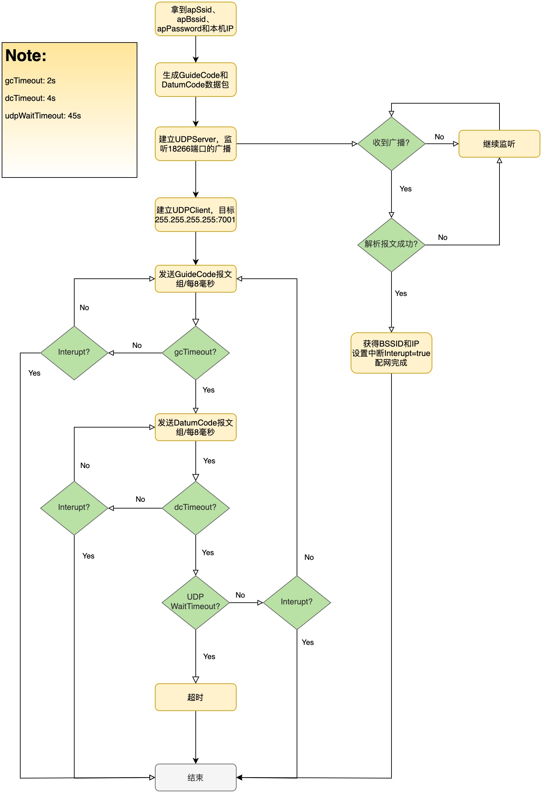
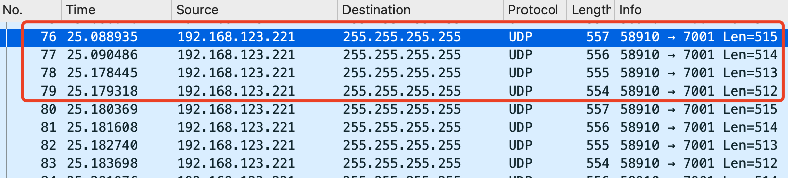
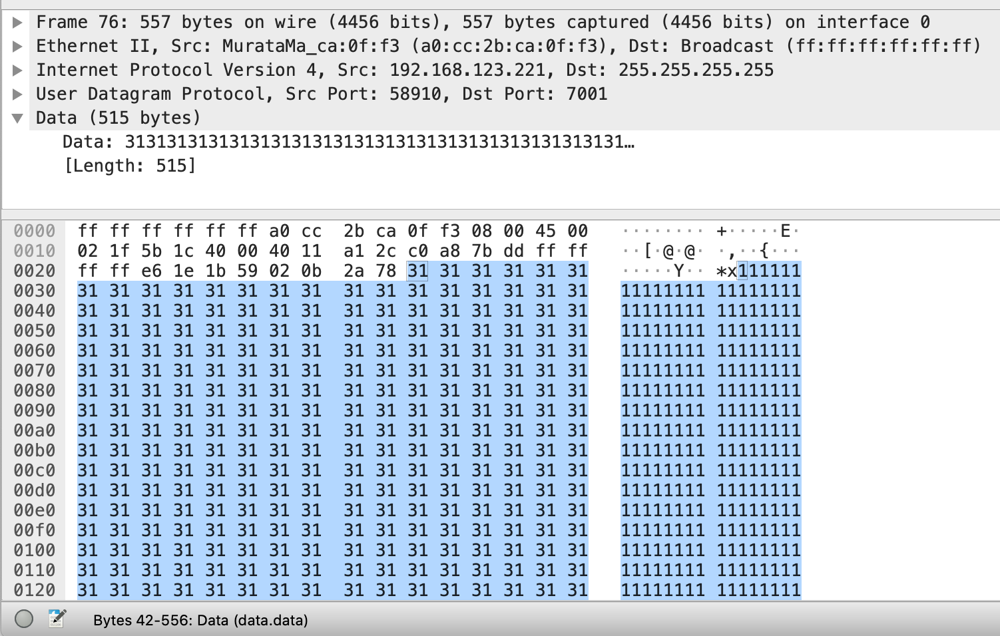
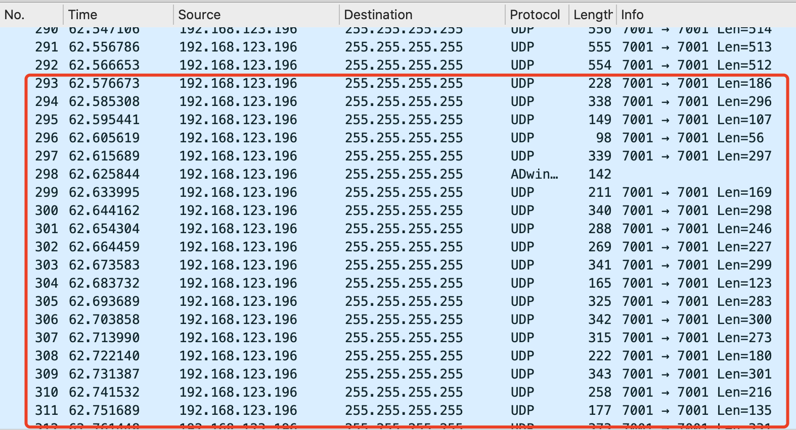
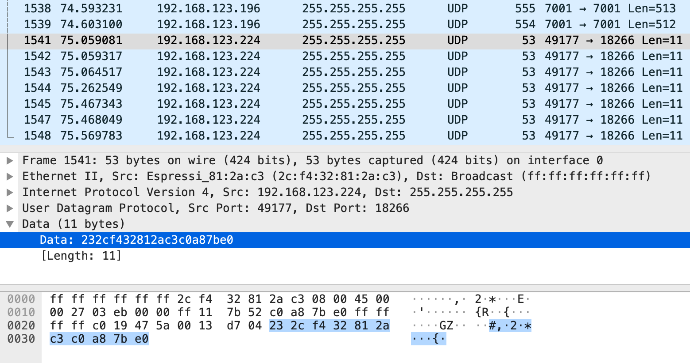
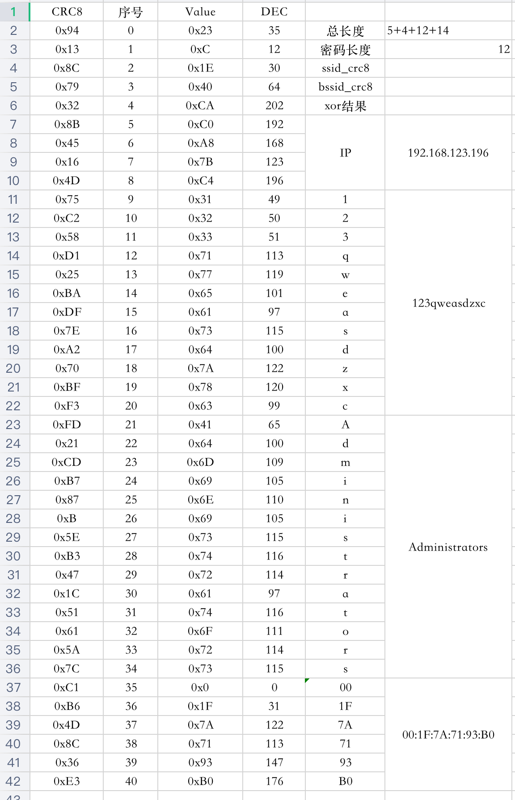

## 写在前面

近年来物联网发展迅速，目前依旧是比较热门的领域，现今世界处处都是物联网，可谓无处不物联（哈哈，扯远了！）。我接触物联网这块比较晚，去年才开始入门，最早的实战项目就是将传感器上云，借助腾讯的[物联网通信平台](https://cloud.tencent.com/document/product/634)，我可以对传感器进行远程控制以及读取传感器采集到的数据。当然，这些都离不开网络（Internet）。设备上云的首要前提就是接入互联网，而接入互联网的方式有很多种（如：有线网络、无线WiFi、NB-IoT、移动蜂窝2G/3G/4G等），不同场景下自然有各自合适的网络接入方式。

我们现在生活中的很多智能家电都是通过WiFi接入的，不用我说大家也能举很多例子（像小米智能家居有小爱同学、空气净化器、电视、冰箱、洗衣机等blablabla~），这些设备刚到手的时候你一般都需要按照指导说明去下载个APP，然后绑定设备给设备配网，给设备配网可不像给手机连上WiFi那么容易，毕竟你买的小爱同学不能接鼠标键盘，也没有操作系统给你用。那么配网是如何完成的呢？

**快速配网的两种途径：**

1. SoftAP配网
2. SmartConfig配网

第一种很好理解，就类似给自己家里的路由器配置网络，你首先通过WiFi或者网线连接你家路由器，然后进入[http://192.168.xxx.xxx](#)进行Web可视化配置，也有一些小型单片机，自己搭载了一个WiFi模组以AP模式运行，你通过指定的APP就可以与其建立通信并发送配置信息过去。但是这种配网方式比较繁琐，用户体验较差。

第二种就比较高级了，你只需要打开设备的配网开关，并在你的手机上连接即将给设备配置的WiFi网络，然后在App或者小程序上输入对应的密码并点击开始，设备能够在很短的时间内（大约7~30s）就可以完成网络的配置。

**这篇文章我将以我自己的学习成果来讲述SmartConfig配网的整个过程**

<!--more-->

## ESP-Touch介绍

> 乐鑫⾃自主研发的 ESP-TOUCH 协议采⽤用的是 Smart Config(智能配置)技术，帮助⽤用户将 采⽤用 ESP8266EX 和 ESP32 的设备(以下简称“设备”)连接⾄至 Wi-Fi ⽹网络。⽤用户只需在⼿手 机上进⾏行行简单操作即可实现智能配置。整个过程如下图所示:

> 由于设备在⼀一开始并未连接⾄至⽹网络，ESP-TOUCH App ⽆无法直接向设备发送信息。通过 ESP-TOUCH 通信协议，具备 Wi-Fi ⽹网络接⼊入能⼒力力的设备(例例如智能⼿手机)就可以向接 ⼊入点 (AP) 发送⼀一系列列 UDP 包，其中每⼀一包的⻓长度(即 Length 字段)都按照 ESP- TOUCH 通信协议进⾏行行编码，SSID 和密码就包含在 Length 字段中，随后设备便便可以获 得并解析出所需的信息。数据包结构如下图所示:

**目前乐鑫公司的这套配网工具是开源的，相关的App可以直接在GitHub下载到，设备端相关的SDK也同样在GitHub开源：[https://github.com/espressifAPP](https://github.com/espressifAPP)**

乐鑫官网关于ESP-Touch的简介和资源下载：[https://www.espressif.com/zh-hans/products/software/esp-touch/overview](https://www.espressif.com/zh-hans/products/software/esp-touch/overview)

其官方中文版指导手册PDF下载地址：[https://www.espressif.com/sites/default/files/documentation/esp-touch_user_guide_cn.pdf](https://www.espressif.com/sites/default/files/documentation/esp-touch_user_guide_cn.pdf)

## 配网流程

手机端处理流程如下图所示：

### 获取AP的SSID、BSSID和密码等信息

一般来说，用户需要事先连接上需要给设备配置的WiFi信号（2.4 GHz），不过有的App可以通过终端OS的内部接口让用户在App页内选择WiFi信号并输入密码完成连接（如微信小程序）。这样App可以轻松获得AP的SSID、BSSID以及用户输入的与之对应的密码，继续完成后续步骤。

### 组装GuideCode和DatumCode数据包

#### GuideCode

GuideCode即前导码，它四个包为一组，这四个包分别是长度为515/514/513/512的UDP数据包。通过Wireshark抓包我们可以清楚的看到：

并且每个包的内容都是完全用`1`填充，其Asccii码`0x31`：

#### DatumCode

DatumCode的前5部分组成有：totalLen、apPwdLen、apSsidCrc、apBssidCrc和totalXOR。

1. totalLen：总数据长度

   5（固定长度）+4（IP地址长度）+n1（密码长度）+n2（SSID长度）

2. apPwdLen：密码长度

3. apSsidCrc：SSID的CRC8结果

4. apBssidCrc：BSSID的CRC8结果

5. totalXOR：全部数据的异或结果

> CRC的参数模型为：CRC-8/MAXIM，标准多项式为：x8+x5+x4+1

后面紧接着的是Data数据，包括：IP地址（4字节）、password（n1字节）、SSID（n2字节）、BSSID（6字节）。

> !注意，Data的发送并不是有序的，每个有效数据会组装成连续的3个包，中间包会标识该组的序列号

DatumCode数据包如下图所示：

### 创建UDPServer负责异步监听配网结果

>  如何知道设备配网成功？首先，设备开启SmartConfig功能时，自身处于Station/混杂模式，它会在所处环境中快速切换各条信道来抓取每个信道中的数据包，当遇到正在发送GuideCode数据包的信道时，锁定该信道并继续接收广播数据，直到收到足够的数据来解码出其中的WiFi密码然后连接Wifi。当成功连接WiFi后设备会向该网络发送多条重复的UDP广播，广播数据包中含有设备的BSSID和它在当前网络中的IP地址。

创建一个监听端口为18266的UDPServer，并异步监听广播地址的数据包。

当有数据包（DataLen为11字节）过来的时候，可以尝试按照以下规则去读取其中的内容：

* 数据包的序号从0开始
* 第1~第6字节为BSSID
* 第7~第10字节为IP地址

上图所示的数据包解析结果为：

* BSSID：2c:f4:32:81:2a:c3
* IP地址：c0.a8.7b.e0（192.168.123.224）

拿到这样的数据后可以确定配网已经完成，可以中断客户端继续发送配网数据包，完成后续业务流程。

### 创建UDPClient负责发送配网数据包

> 如何将配网数据包发送出去？创建UDPClient向广播地址255.255.255.255的7001端口循环发送！

**GuideCode发送规则**

4个包为一组循环发送，每包发送间隔8毫秒。

2秒为一个周期，周期之后发送`DatumCode`。

**DatumCode的发送规则**

3个包（每个包9bit）为一组，每包发送间隔8毫秒，每组含一个有效数据，其组成格式如下表：

| 每组包序号 | 控制位(1bit) | 高4位(4bit)                  | 低4位(4bit)  |
| ---------- | ------------ | ---------------------------- | ------------ |
| pkg1       | 0x00         | crc的高4bit                  | data的高4bit |
| pkg2       | 0x01         | 传输序号（8bit都是序号自身） |              |
| pkg3       | 0x00         | crc的低4bit                  | data的低4bit |

>  其中传输序号从0开始，每组序号在前一组序号上+1。
>
> 当数据发送时，必须要在每个包的基础上+40（协议规定要增加一个EXTRA_LEN）

4秒为一个周期，周期之后重新开始发送`GuideCode`。

### 按照流程执行

根据流程图执行，文字描述如下：

1. 发送GuideCode，Len=515
2. 发送GuideCode，Len=514
3. 发送GuideCode，Len=513
4. 发送GuideCode，Len=512
5. 循环步骤1-4，直到2秒超时
6. 发送DatumCode组
7. 循环步骤6，直到4秒超时
8. 从步骤1开始重新开始，直到整个过程45秒超时。

## 如何解码？

将数据包整理后如下表：

| No.  | DC1  | DC2  | DC3  |      | DC1-40 | DC2-40 | DC3-40 |      | HEX1 | HEX2  | HEX3 |      | CRC8 | Pack No. | Value |
| ---- | ---- | ---- | ---- | ---- | ------ | ------ | ------ | ---- | ---- | ----- | ---- | ---- | ---- | -------- | ----- |
| 1    | 186  | 296  | 107  |      | 146    | 256    | 67     |      | 0x92 | 0x100 | 0x43 |      | 0x94 | 0        | 0x23  |
| 2    | 56   | 297  | 100  |      | 16     | 257    | 60     |      | 0x10 | 0x101 | 0x3C |      | 0x13 | 1        | 0xC   |
| 3    | 169  | 298  | 246  |      | 129    | 258    | 206    |      | 0x81 | 0x102 | 0xCE |      | 0x8C | 2        | 0x1E  |
| 4    | 156  | 299  | 184  |      | 116    | 259    | 144    |      | 0x74 | 0x103 | 0x90 |      | 0x79 | 3        | 0x40  |
| 5    | 100  | 300  | 82   |      | 60     | 260    | 42     |      | 0x3C | 0x104 | 0x2A |      | 0x32 | 4        | 0xCA  |
| 6    | 180  | 301  | 216  |      | 140    | 261    | 176    |      | 0x8C | 0x105 | 0xB0 |      | 0x8B | 5        | 0xC0  |
| 7    | 232  | 331  | 56   |      | 192    | 291    | 16     |      | 0xC0 | 0x123 | 0x10 |      | 0xC1 | 35       | 0x0   |
| 8    | 114  | 302  | 128  |      | 74     | 262    | 88     |      | 0x4A | 0x106 | 0x58 |      | 0x45 | 6        | 0xA8  |
| 9    | 63   | 303  | 147  |      | 23     | 263    | 107    |      | 0x17 | 0x107 | 0x6B |      | 0x16 | 7        | 0x7B  |
| 10   | 116  | 304  | 252  |      | 76     | 264    | 212    |      | 0x4C | 0x108 | 0xD4 |      | 0x4D | 8        | 0xC4  |
| 11   | 217  | 332  | 151  |      | 177    | 292    | 111    |      | 0xB1 | 0x124 | 0x6F |      | 0xB6 | 36       | 0x1F  |
| 12   | 155  | 305  | 121  |      | 115    | 265    | 81     |      | 0x73 | 0x109 | 0x51 |      | 0x75 | 9        | 0x31  |
| 13   | 235  | 306  | 74   |      | 195    | 266    | 34     |      | 0xC3 | 0x10A | 0x22 |      | 0xC2 | 10       | 0x32  |
| 14   | 123  | 307  | 171  |      | 83     | 267    | 131    |      | 0x53 | 0x10B | 0x83 |      | 0x58 | 11       | 0x33  |
| 15   | 111  | 333  | 258  |      | 71     | 293    | 218    |      | 0x47 | 0x125 | 0xDA |      | 0x4D | 37       | 0x7A  |
| 16   | 255  | 308  | 57   |      | 215    | 268    | 17     |      | 0xD7 | 0x10C | 0x11 |      | 0xD1 | 12       | 0x71  |
| 17   | 79   | 309  | 127  |      | 39     | 269    | 87     |      | 0x27 | 0x10D | 0x57 |      | 0x25 | 13       | 0x77  |
| 18   | 222  | 310  | 205  |      | 182    | 270    | 165    |      | 0xB6 | 0x10E | 0xA5 |      | 0xBA | 14       | 0x65  |
| 19   | 175  | 334  | 233  |      | 135    | 294    | 193    |      | 0x87 | 0x126 | 0xC1 |      | 0x8C | 38       | 0x71  |
| 20   | 254  | 311  | 281  |      | 214    | 271    | 241    |      | 0xD6 | 0x10F | 0xF1 |      | 0xDF | 15       | 0x61  |
| 21   | 159  | 312  | 267  |      | 119    | 272    | 227    |      | 0x77 | 0x110 | 0xE3 |      | 0x7E | 16       | 0x73  |
| 22   | 206  | 313  | 76   |      | 166    | 273    | 36     |      | 0xA6 | 0x111 | 0x24 |      | 0xA2 | 17       | 0x64  |
| 23   | 97   | 335  | 139  |      | 57     | 295    | 99     |      | 0x39 | 0x127 | 0x63 |      | 0x36 | 39       | 0x93  |
| 24   | 159  | 314  | 50   |      | 119    | 274    | 10     |      | 0x77 | 0x112 | 0x0A |      | 0x70 | 18       | 0x7A  |
| 25   | 223  | 315  | 288  |      | 183    | 275    | 248    |      | 0xB7 | 0x113 | 0xF8 |      | 0xBF | 19       | 0x78  |
| 26   | 286  | 316  | 91   |      | 246    | 276    | 51     |      | 0xF6 | 0x114 | 0x33 |      | 0xF3 | 20       | 0x63  |
| 27   | 275  | 336  | 88   |      | 235    | 296    | 48     |      | 0xEB | 0x128 | 0x30 |      | 0xE3 | 40       | 0xB0  |
| 28   | 284  | 317  | 249  |      | 244    | 277    | 209    |      | 0xF4 | 0x115 | 0xD1 |      | 0xFD | 21       | 0x41  |
| 29   | 78   | 318  | 60   |      | 38     | 278    | 20     |      | 0x26 | 0x116 | 0x14 |      | 0x21 | 22       | 0x64  |
| 30   | 238  | 319  | 261  |      | 198    | 279    | 221    |      | 0xC6 | 0x117 | 0xDD |      | 0xCD | 23       | 0x6D  |
| 31   | 222  | 320  | 161  |      | 182    | 280    | 121    |      | 0xB6 | 0x118 | 0x79 |      | 0xB7 | 24       | 0x69  |
| 32   | 174  | 321  | 166  |      | 134    | 281    | 126    |      | 0x86 | 0x119 | 0x7E |      | 0x87 | 25       | 0x6E  |
| 33   | 46   | 322  | 225  |      | 6      | 282    | 185    |      | 0x06 | 0x11A | 0xB9 |      | 0xB  | 26       | 0x69  |
| 34   | 127  | 323  | 267  |      | 87     | 283    | 227    |      | 0x57 | 0x11B | 0xE3 |      | 0x5E | 27       | 0x73  |
| 35   | 223  | 324  | 92   |      | 183    | 284    | 52     |      | 0xB7 | 0x11C | 0x34 |      | 0xB3 | 28       | 0x74  |
| 36   | 111  | 325  | 154  |      | 71     | 285    | 114    |      | 0x47 | 0x11D | 0x72 |      | 0x47 | 29       | 0x72  |
| 37   | 62   | 326  | 233  |      | 22     | 286    | 193    |      | 0x16 | 0x11E | 0xC1 |      | 0x1C | 30       | 0x61  |
| 38   | 127  | 327  | 60   |      | 87     | 287    | 20     |      | 0x57 | 0x11F | 0x14 |      | 0x51 | 31       | 0x74  |
| 39   | 142  | 328  | 71   |      | 102    | 288    | 31     |      | 0x66 | 0x120 | 0x1F |      | 0x61 | 32       | 0x6F  |
| 40   | 127  | 329  | 202  |      | 87     | 289    | 162    |      | 0x57 | 0x121 | 0xA2 |      | 0x5A | 33       | 0x72  |
| 41   | 159  | 330  | 235  |      | 119    | 290    | 195    |      | 0x77 | 0x122 | 0xC3 |      | 0x7C | 34       | 0x73  |

每一行有3个包，表示一个有效数据，DC1~DC3为一组数据包的LEN值，后面接着的3列为DC1~DC3减去40后的值，再后面是对应的16进制表示。

最后3列则是解码后的值，CRC8由HEX1的高4bit和HEX3的高4bit组成，Pack No.为HEX2的低8bit，Value由HEX1的低4bit和HEX3的低4bit组成。

这样还不能很直观的看出来结果，我们用Excel排序并利用相关函数（如：CODE等）将其直接输出可阅读的内容，如下图所示：

## 写在最后

终于认认真真（FuYanLiaoShi）的做完了这次的作业（XuQiu），本文讲述的内容可能不太严谨或者说是比较浅显，所以我在这里贡献出来我的源代码，以供深入探索。

**相关链接**

* 我的Golang作业：[https://github.com/haowanxing/ESPTouch-Go-Demo](https://github.com/haowanxing/ESPTouch-Go-Demo)
* 参考博文：[https://blog.csdn.net/flyingcys/article/details/54670688](https://blog.csdn.net/flyingcys/article/details/54670688)
* 官方开源代码：[https://github.com/EspressifApp/EsptouchForAndroid](https://github.com/EspressifApp/EsptouchForAndroid)

