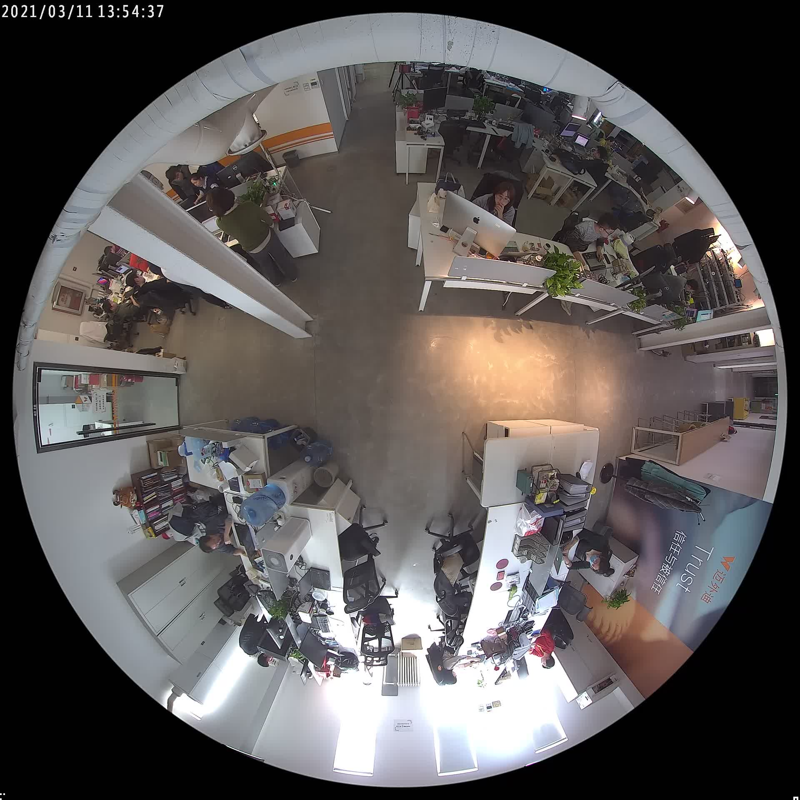
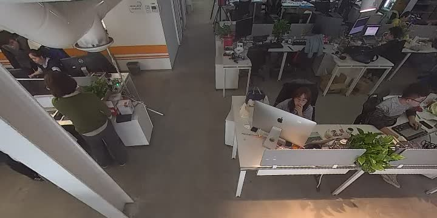
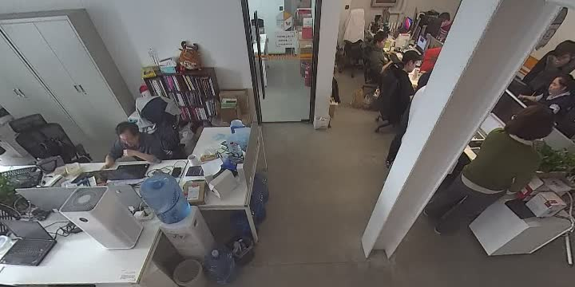
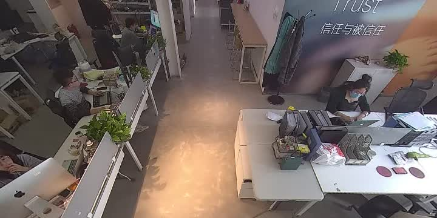
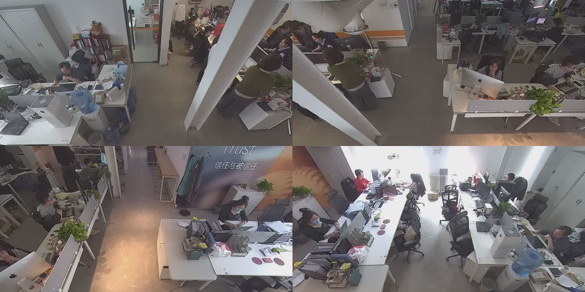

## 介绍

首先，FFmpeg是一套可以用来记录、转换数字音频、视频，并能将其转化为流的开源计算机程序。它的功能强大，这里就不多做阐述了。

本次实验主要是为了学习FFmpeg的Filter功能，它提供了很多音视频的特效处理，比如：视频的缩放、翻转、叠加等等。常用的Filter有：

* Scale：画面的缩放
* Overlay：画面的叠加
* Crop：画面的裁剪
* More：[查看更多](http://ffmpeg.org/ffmpeg-filters.html)

我们可以通过命令查看全部Filter的简介：

```bash
ffmpeg -filters
```

## 实验

### 原始材料

我们手里现在有一段鱼眼镜头录制的视频源文件，命名：`original.mp4`。我们先来看看它长什么样子：



### 尝试球形转方形

这一步，我暂时还没找到一个很好的方法把其展平成一个广角镜头全景的画面，但是我使用v360这个filter通过不断修改参数，得到了一个比较满意的部分画面的方形画面。

该Filter的基本参数格式如下：

```bash
v360=input:output:format_1:arg_name=value
```

其中`input`和`output`分别是原始投影格式和目标投影格式，这里我们是从`鱼眼`视频转换为`常规`视频，所以要填入的参数为：

```bash
v360=input=fisheye:output=flat # 都有哪些投影格式，可以通过ffmpeg -h filter=v360获取查看
```

`format_1`是指具体要设置的格式，这里我并没有用到。`arg_name`和`value`指具体的参数项和值。

我的使用例子：

```bash
v360=input=fisheye:output=flat:ih_fov=180:iv_fov=180:h_fov=90:v_fov=60:w=720:h=360:pitch=45
```

解释一下，其中`ih_fov`和`iv_fov`分别表示设置的输入横向视野范围和输入纵向视野范围，我这里都设置为180度；`h_fov`和`v_fov`分别表示设置的输出横向视野范围和输出纵向视野范围，我这里设置横向90度，纵向60度。然后还设置了输出画面的宽高为720x360，俯仰旋转角（pitch）为45度。

我的个人理解（个人瞎猜），就如同人眼可接受光的范围，理论上横向和纵向都能够覆盖180度的范围，但是我们在眼球不转动的情况下，有效的水平视野大概是90度，纵向视野60度。因为这个是我具体调参的出来的个人觉得比较好的参数条件，所以不具有权威性！哈哈！

那么现在能输出一个什么样的画面呢？



Nice！这就已经很像一个普通摄像头的画面了。那么如何得到其它几个方向的画面呢？前面我们有提到，FFmpeg可以使画面旋转！如果我先将原始画面旋转一下，让其它几个方向的画面都转到上面，然后转换画面不就行了吗？

### 画面旋转

FFmpeg有个Filter叫做`transpose`。它可以非常简单的完成画面的旋转或翻转：

<!---more--->

```bash
# 输入ffmpeg -h filter=transpose查一下说明
Filter transpose
  Transpose input video.
    slice threading supported
    Inputs:
       #0: default (video)
    Outputs:
       #0: default (video)
transpose AVOptions:
  dir               <int>        ..FV...... set transpose direction (from 0 to 7) (default cclock_flip)
     cclock_flip     0            ..FV...... rotate counter-clockwise with vertical flip
     clock           1            ..FV...... rotate clockwise
     cclock          2            ..FV...... rotate counter-clockwise
     clock_flip      3            ..FV...... rotate clockwise with vertical flip
  passthrough       <int>        ..FV...... do not apply transposition if the input matches the specified geometry (from 0 to INT_MAX) (default none)
     none            0            ..FV...... always apply transposition
     portrait        2            ..FV...... preserve portrait geometry
     landscape       1            ..FV...... preserve landscape geometry
```

简单来说：

* `transpose=0`逆时针旋转90度并纵向翻转一次
* `transpose=1`顺时针旋转90度
* `transpose=2`逆时针旋转90度
* `transpose=3`顺时针旋转90度并纵向翻转一次

我们分别使用如下参数，可获得的画面：

```bash
#顺时针旋转90度
transpose=1,v360=input=fisheye:output=flat:ih_fov=180:iv_fov=180:h_fov=90:v_fov=60:w=720:h=360:pitch=45
#得到左方镜头画面
```



```bash
#逆时针旋转90度
transpose=2,v360=input=fisheye:output=flat:ih_fov=180:iv_fov=180:h_fov=90:v_fov=60:w=720:h=360:pitch=45
#得到右方镜头画面
```



```bash
#顺时针旋转90度2次
transpose=1,transpose=1,v360=input=fisheye:output=flat:ih_fov=180:iv_fov=180:h_fov=90:v_fov=60:w=720:h=360:pitch=45
#得到后方镜头画面
```


### 画面拼接

做到上面的效果已经可以将鱼眼镜头的视频流拆分成4个不同方向的视频分别输出到4个流了，但是我还想将它们合成一个视频流，同时展示4个画面！

这里我们就需要用到`overlay`（画面叠加）了！

具体的思路如下：

1. 创建一张画布，大小为1440x720。
2. 将画布分成4个区域，分别叫做`upperleft`、`upperright`、`lowerleft`、`lowerright`，并放置视频的`左`、`上`、`右`、`下`。

上面用到语法叫做`filterchain`，是将一个或多个`filter`用`,`号分隔，这里还需要用到的语法叫做：`filtergraph`，是将`filterchain`用`;`号分隔。

最终的命令如下：

```bash
ffmpeg -i original.mp4 -filter_complex "nullsrc=size=1440x720 [base]; [0:v] transpose=1,v360=input=fisheye:output=flat:ih_fov=180:iv_fov=180:h_fov=90:v_fov=60:w=720:h=360:pitch=45 [upperleft]; [0:v] v360=input=fisheye:output=flat:ih_fov=180:iv_fov=180:h_fov=90:v_fov=60:w=720:h=360:pitch=45 [upperright]; [0:v] transpose=2,v360=input=fisheye:output=flat:ih_fov=180:iv_fov=180:h_fov=90:v_fov=60:w=720:h=360:pitch=45 [lowerleft]; [0:v] transpose=1,transpose=1,v360=input=fisheye:output=flat:ih_fov=180:iv_fov=180:h_fov=90:v_fov=60:w=720:h=360:pitch=45 [lowerright]; [base][upperleft] overlay [tmp1]; [tmp1][upperright] overlay=720:0 [tmp2]; [tmp2][lowerleft] overlay=0:360 [tmp3];[tmp3][lowerright] overlay=720:360" -c:v libx264 -an -y out.mp4
```

叠加的步骤如下：

1. 创建一个空的画布[base]，size=1440x720
2. 将输入的视频[0:v]分别通过`transpose`和`v360`转换成[upperleft]、[upperright]、[lowerlet]和[lowerright]4个流
3. 将[base]和[upperleft]叠加成[tmp1]，偏移量（x=0, y=0）
4. 将[tmp1]和[upperright]叠加成[tmp2]，偏移量（x=720, y=0）
5. 将[tmp2]和[lowerleft]叠加成[tmp3]，偏移量（x=0, y=360）
6. 将[tmp3]和[lowerright]叠加成最终视频，偏移量（x=720, y=360）

最终画面展示：




## 参考文献

* [ffmpeg 实现多宫格效果，视频拼接合成](https://www.cnblogs.com/famhuai/p/10276081.html)
* [FFmpeg filter的使用介绍](https://www.jianshu.com/p/b16835da62ab)
* [Does v360 filter support dewarping circular fisheye images?](https://www.mail-archive.com/ffmpeg-user@ffmpeg.org/msg28370.html)