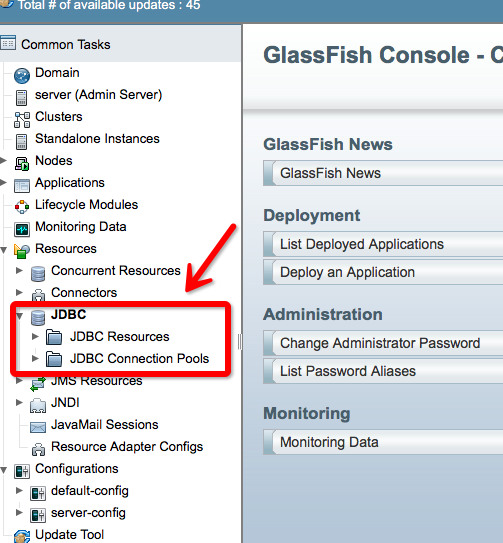
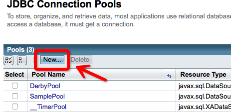
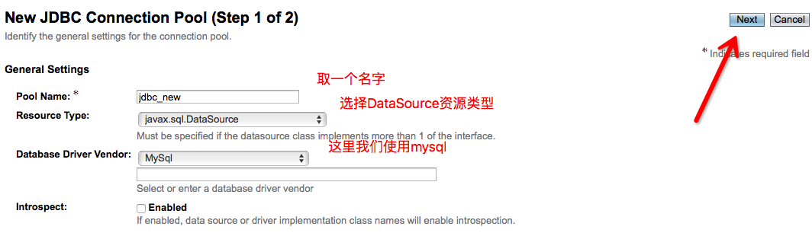
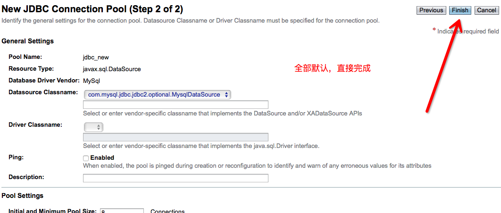
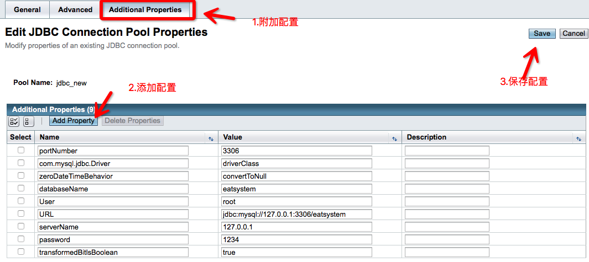
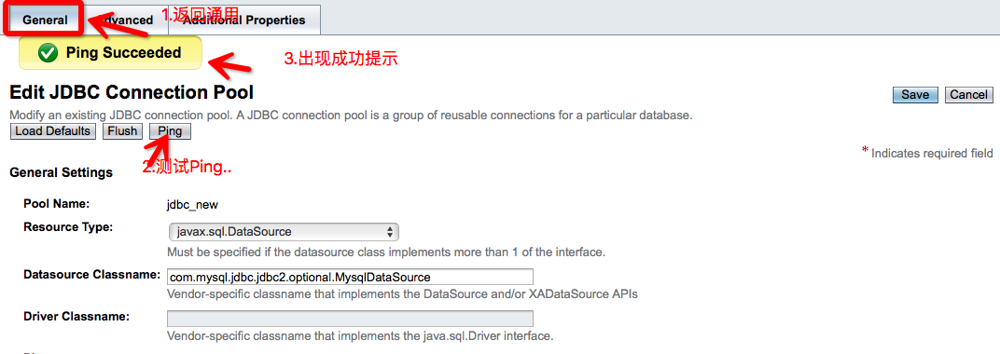
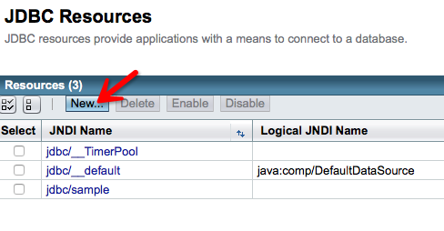
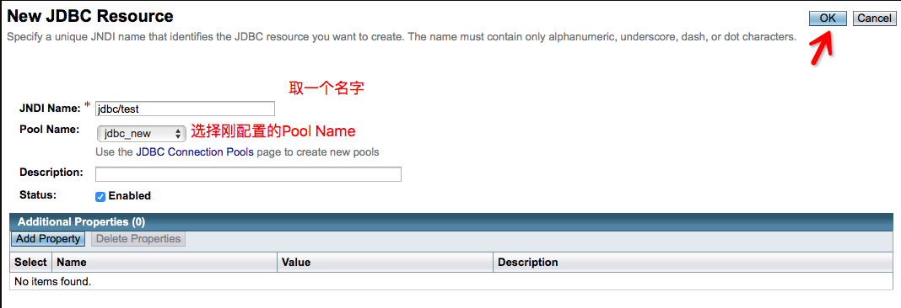
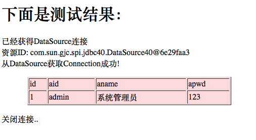

## 1、首先启动glassfish服务器，在地址栏中输入[http://localhost:4848/](http://localhost:4848/),进入服务器的配置界面,如下:

## 2、在Common Tasks下选择Resources的JDBC，可以看到JDBC资源(JDBC Resources)和Connection Pools(连接池)，在Connection Pools(连接池)中点击New按钮，建立一个连接池jdbc_new，如下：

<!--more-->

### 配置基本信息，如下：

### Next后的第二步：

### Finish之后进入刚刚配置的jdbc_new选择附加配置,如图配置相关数据：

## 3、配置完成之后，回到之前的General中测试Ping:

注意：如果此时出现**javax.resource.ResourceException: Class name is wrong orclasspath is not set for : com.mysql.jdbc.jdbc2.optional.MysqlDataSource**这个错误时候，是因为没有把mysql驱动包mysql-connector-java-5.1.20-bin.jar放入glassfish安装目录domains\domain1\lib\ext下；

解决方法：把mysql驱动包mysql-connector-java-5.1.20-bin.jar放入glassfish安装目录domains\domain1\lib\ext下并重新启动glassfish服务器就可以了。

## 4、创建连接池成功之后，点击JDBC Resources，在JDBC资源的配置界面中，Pool  Name(连接池名称)就会出现刚配置成功的连接池jdbc_new,其配置界面如下：

## 5、在配置界面的JNDI Name中配置JNDI的名字为jdbc/test(这个名字可以自己取).至此，连接池和数据源都以配置完成。

相关配置到这里就完成了，我们还需要做一个事情，那就是，测试。

## 6、测试连接数据库是否成功：

我们在Jave Web 项目中新建一个jsp页面来测试，代码如下：
<pre lang="java">
<%-- 
    Document   : jdbc_test
    Created on : 2015-11-8, 13:24:37
    Author     : 刘经济 <york_mail@qq.com>
--%>
<%@page contentType="text/html" pageEncoding="UTF-8"%>
<%@ page import="javax.naming.*" %>
<%@ page import="javax.sql.*" %>
<%@ page import="java.sql.*" %>
<html>
    <head>
        <title>测试GlassFish配置的Mysql数据库连接池</title>
    </head>
    <body>

# 下面是测试结果：

        <%
            Connection conn = null;
            Statement stmt = null;
            ResultSet rs = null;
            ResultSetMetaData md = null;
            try {
                Context initCtx = new InitialContext();
                DataSource ds = (DataSource) initCtx.lookup("jdbc/test");
                if (ds != null) {
                    out.println("已经获得DataSource连接
");
                    out.println("资源ID: " + ds.toString() + "
");
                    conn = ds.getConnection();
                    stmt = conn.createStatement();
                    out.println("从DataSource获取Connection成功!

");
                    rs = stmt.executeQuery("select * from admins");
                    md = rs.getMetaData();
                    out.println("<table border=1 width=80%  align=center bgcolor=#ffdddd>");
                    out.println("<tr>");
                    for (int i = 0; i < md.getColumnCount(); i++) {
                        out.println("<td>" + md.getColumnName(i + 1) + "</td>");
                    }
                    while (rs.next()) {
                        out.println("<tr>");
                        out.println("<td>" + rs.getString(1) + "</td>");
                        out.println("<td>" + rs.getString(2) + "</td>");
                        out.println("<td>" + rs.getString(3) + "</td>");
                        out.println("<td>" + rs.getString(4) + "</td>");
                        out.println("</tr>");
                    }
                    out.println("</table>");
                    conn.close();
                    out.println("
关闭连接..
");
                }
            } catch (Exception e) {
                out.println("

出现异常..
");
                out.println(e.toString());
            }
        %>
    </body>
</html>
</pre>
&nbsp;

## 7、我们的测试结果：

