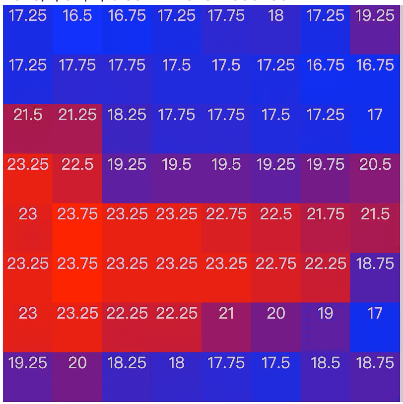
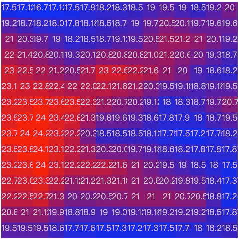
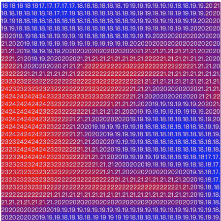
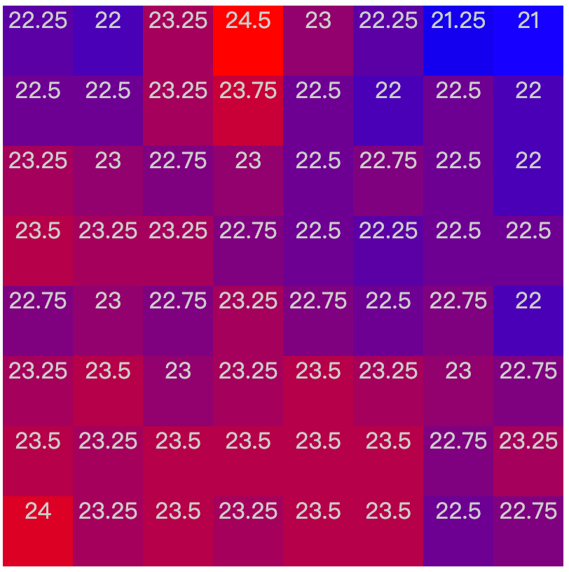
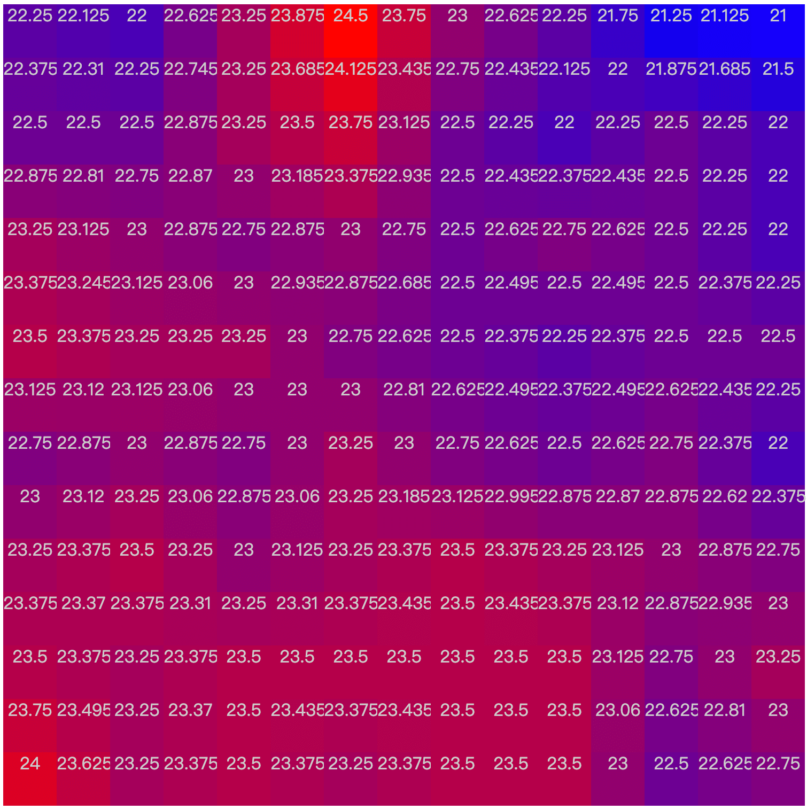
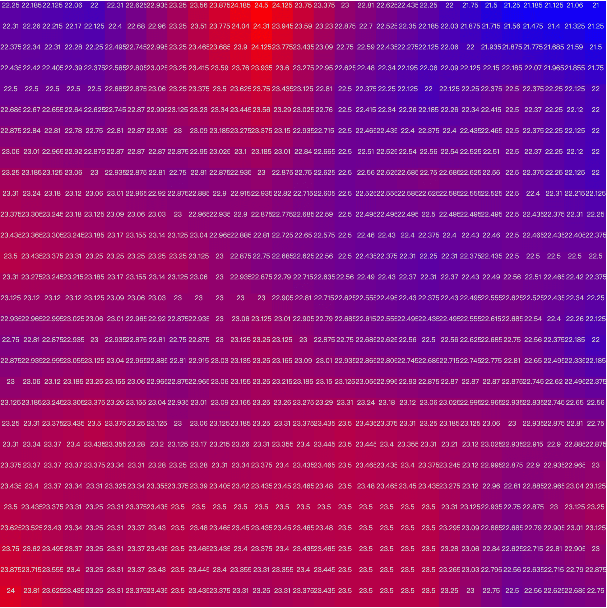

> 此篇文章用于记录工作中所需的数据插值算法：线性插值（以两个相邻数据的均值作为中间值插入两数之间）

惊喜预览图：

原始数据：一次插值数据：二次插值数据：

现有数据是一个8x8的温度矩阵(值为真实温度的100倍)，存放在一个长度为64的一维数组中，测试数据如下：

```c
2275,2250,2350,2350,2325,2350,2325,2400,2325,2275,2350,2350,2350,2350,2325,2350,2275,2300,2325,2350,2325,2300,2350,2325,2200,2275,2250,2275,2325,2275,2300,2275,2250,2250,2225,2250,2275,2325,2325,2350,2200,2250,2275,2250,2300,2275,2300,2325,2200,2250,2200,2250,2375,2325,2250,2250,2100,2125,2225,2300,2450,2325,2200,2225
```

## 问题分析

将8x8的矩阵利用插值算法转化成15x15（8个数据中插入7个虚拟值）矩阵根本思路：

1. 将8x8的数据进行横向插值为一个15x8的数组；
2. 将15x8的数字进行纵向插值为一个15x15的数组；

转化公式的分析：

先将问题简化，分析一个4x4的矩阵：

|  0   |  1   |  2   |  3   |
| :--: | :--: | :--: | :--: |
|  4   |  5   |  6   |  7   |
|  8   |  9   |  10  |  11  |
|  12  |  13  |  14  |  15  |

横向插值后的数据位置变化：

| 0    | x    | 1    | x    | 2    | x    | 3    |
| :--- | :--- | :--- | :--- | :--- | :--- | :--- |
| 4    | x    | 5    | x    | 6    | x    | 7    |
| 8    | x    | 9    | x    | 10   | x    | 11   |
| 12   | x    | 13   | x    | 14   | x    | 15   |

### 分析一：

位置：0=>0，1=>2，2=>4，3=>6，4=>7，5=>9，6=>11，7=>13，8=>14……

由此推断原始数据的新位置，设原每行长度为w，原位置为i，则新每行长度为2w-1，新位置为n=i\*2-i/w。

那么当i满足条件：i不为第一列数据（即i%w不为0）时，可计算前一个插值数据。

设插值为x，上述表格数据存放a数组，则x的数据位为k-1，根据插值算法，则值x=a[k-1]=(a[k-2]+a[k])/2。

现在问题变为分析一个7*4的矩阵：

|  0   |  1   |  2   |  3   |  4   |  5   |  6   |
| :--: | :--: | :--: | :--: | :--: | :--: | :--: |
|  7   |  8   |  9   |  10  |  11  |  12  |  13  |
|  14  |  15  |  16  |  17  |  18  |  19  |  20  |
|  21  |  22  |  23  |  24  |  25  |  26  |  27  |

纵向插值后的数据位置变化：

| 0    | 1    | 2    | 3    | 4    | 5    | 6    |
| :--- | :--- | ---- | ---- | ---- | ---- | ---- |
| x    | x    | x    | x    | x    | x    | x    |
| 7    | 8    | 9    | 10   | 11   | 12   | 13   |
| x    | x    | x    | x    | x    | x    | x    |
| 14   | 15   | 16   | 17   | 18   | 19   | 20   |
| x    | x    | x    | x    | x    | x    | x    |
| 21   | 22   | 23   | 24   | 25   | 26   | 27   |

### 分析二：

第一行位置0-6不变，从第二行的7开始：7=>14，8=>15……，从第三行的14开始：14=>21，15=>22…… 以此类推

由此推断原始数据的新位置：设原位置为i，则新位置为：i\*2-i%w。

那么当满足条件：从原始数据的第二行开始（即i>=w）时，可计算当前位置上一行的插值数据。

设插值为x，上述表格存放在a数组中，则x的数据位为k-w，根据插值算法，则值x=a[k-w]=(a[k-2w]+a[k])/2。

由此经过两步的演算，得出了一个7x7的长度为49的数组。

## 代码示例：

JavaScript版本

```javascript
function Linear(old, width){
  let data = [];
  //横向插值
  for(let i in old){
    i = parseInt(i);
    let v = old[i];
    let k = i*2-parseInt(i/width);
    data[k] = v;
    if(i%width != 0){
      data[k-1] = (parseInt(data[k-2])+parseInt(data[k]))/2;
    }

  }
  let data2 = data;
  data = [];
  width = width*2-1;
  //纵向插值
  for(let i in data2){
    i = parseInt(i);
    let v = data2[i];
    let k = i*2-i%width;
    data[k] = v;
    if(k>=width){
      data[k-width] = (parseInt(data[k])+parseInt(data[k-width*2]))/2;
    }
  }
  return data;
}
```


用HTML渲染数据并上色结果：

- 原始数据

  

- 一次插值数据

  

- 二次差值数据

  


### Demo代码

```html
<!DOCTYPE html>
<html>
<head>
	<title>Demo</title>
	<style type="text/css">
		span {margin: 0px; display:inline-block; text-align:center;color: #ccc}
		.canvascfg .num {width: 20px;}
	</style>
</head>
<body>
	<div id="data" style="width: 100%;height: 100%;line-height: 20px"></div>
	<script src="https://cdn.bootcss.com/jquery/3.4.1/jquery.min.js"></script>
	<script type="text/javascript">
		let originalData = [2275,2250,2350,2350,2325,2350,2325,2400,2325,2275,2350,2350,2350,2350,2325,2350,2275,2300,2325,2350,2325,2300,2350,2325,2200,2275,2250,2275,2325,2275,2300,2275,2250,2250,2225,2250,2275,2325,2325,2350,2200,2250,2275,2250,2300,2275,2300,2325,2200,2250,2200,2250,2375,2325,2250,2250,2100,2125,2225,2300,2450,2325,2200,2225];
		let Color = {
			Blue:[0,0,255],
			Yellow:[255,255,0],
			Red:[255,0,0]
		};
		let Config = {
			canvasWidth:8,
			canvasHeight:8,
			xValue:2,	//线性插值次数为xVlaue-1
		};
		Draw(originalData);
		function Linear(old, width){
        	let data = [];
        	//横向插值
        	for(let i in old){
        		i = parseInt(i);
        		let v = old[i];
        		let k = i*2-parseInt(i/width);
        		data[k] = v;
        		if(i%width != 0){
        			data[k-1] = (parseInt(data[k-2])+parseInt(data[k]))/2;
        		}

        	}
        	let data2 = data;
        	data = [];
        	width = width*2-1;
        	//纵向插值
        	for(let i in data2){
        		i = parseInt(i);
        		let v = data2[i];
        		let k = i*2-i%width;
    			data[k] = v;
    			if(k>=width){
    				data[k-width] = (parseInt(data[k])+parseInt(data[k-width*2]))/2;
    			}
        	}
        	return data;
		}
		function ComputeColor(from,to,ratio){
        	var r = Math.round(from[0]*(1-ratio)+to[0]*ratio);
        	var g = Math.round(from[1]*(1-ratio)+to[1]*ratio);
        	var b = Math.round(from[2]*(1-ratio)+to[2]*ratio);
        	return [r,g,b];
        }
		function GetColor(num, max, min){
        	var ratio = (num - min) / (max - min);
        	var color = ComputeColor(Color.Blue, Color.Red, ratio);
        	return color;
        }
        function Draw(tmp){
        	let canvasHeight = Config.canvasHeight;
    		let canvasWidth = Config.canvasWidth;
    		for(let i = 1;i<Config.xValue;i++){
    			tmp = Linear(tmp, (canvasWidth-1)*Math.pow(2,i-1)+1);
    		}
        	if(Config.xValue > 1){
        		canvasHeight = (Config.canvasHeight-1)*Math.pow(2,Config.xValue-1)+1;
        		canvasWidth = (Config.canvasWidth-1)*Math.pow(2,Config.xValue-1)+1;
        	}
        	low = high = tmp[0];
        	for (var i = tmp.length - 1; i >= 0; i--) {
        		if( tmp[i] > high ) high = tmp[i];
        		if( tmp[i] < low ) low = tmp[i];
        	}
        	let index = 2;
        	let span = '';
        	for(var i = 1; i <=canvasHeight; i++,index++){
        		for(var j = 1; j <= canvasWidth; j++){
        			// var idx = (i)*canvasWidth-j;
        			// var idx = (i-1)*canvasWidth+j-1;
        			var idx = canvasWidth*(canvasHeight-i+1)-j;
        			var color = GetColor(tmp[idx], high, low);
        			span += GetSpan(color,tmp[idx]);
        		}
        		span += '<br>';
        	}
        	$("#data").html(span);
        }
        function GetSpan(color,num){
        	var span = '<span style="width:50px;height:50px;background-color:rgb('+color[0]+','+color[1]+','+color[2]+')">'+(num/100)+'</span>';
        	return span;
        	$("#wind").append(span);
        }
	</script>
</body>
</html>
```

