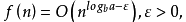

渐进符号是分析算法时间复杂度的常用记号，对于某个规模为n的问题，当n足够大时，就可以忽略掉复杂度表达式中的低阶项和最高次项的系数，由此引出“渐进复杂度”，并且用渐进符号来对“渐进复杂度”进行表达。

### 一、渐进符号

1、O(大O符号）：上界
定义：若存在两个正的常数 c 和 n0 , 对于任意 n≥n0 , 都有 T( n)≤cf( n) ,则称T( n) = O( f( n) )(或称算法在 O( f( n))中)。

大 O 符号用来描述增长率的上限,表示 T( n)的增长最多像 f( n)增长的那样快,也就是说, 当输入规模为 n时, 算法消耗时间的最大值,这个上限的阶越低, 结果就越有价值。上界是对算法效率的一种承诺。

大O符号的含义如下图所示：

2、Ω（大Ω符号）：下界
定义：若存在两个正的常数 c和 n0 ,对于任意 n≥ n0 , 都有 T( n)≥cg( n) ,则称T( n) = Ω( g( n) )(或称算法在 Ω( g( n) )中)。

大 Ω符号用来描述增长率的下限, 也就是说, 当输入规模为 n 时,算法消耗时间的最小值。与大 O 符号对称, 这个下限的阶越高,结果就越有价值。

大Ω号的含义如下图所示：

大 Ω符号常用来分析某个问题或某类算法的时间下界。例如, 矩阵乘法问题的时间下界为 Ω( n^2) , 是指任何两个 n×n 矩阵相乘的算法的时间复杂性不会小于 n^2
, 基于比较的排序算法的时间下界为 Ω( nlog 2 n) ,是指无法设计出基于比较的排序算法, 其时间复杂性小于 nlog 2 n。

大 Ω符号常常与大 O 符号配合以证明某问题的一个特定算法是该问题的最优算法,或是该问题中的某算法类中的最优算法。

3、Θ(theta) ：紧确界
定义：若存在 3 个正的常数 c1 、 c2 和 n0 ,对于任意 n≥ n0 , 都有 c1f(n)≥ T(n)≥ c2f(n) , 则称 T( n) = Θ( f(n))。
Θ符号意味着 T( n)与 f( n)同阶, 用来表示算法的精确阶。

Θ符号的含义如下图所示。

### 二、主定理
主定理主要用于对一些递归算法进行复杂性分析，这类算法的特征是：其复杂性表达式是以递推关系式表达的。主定理并不适用于所有类型的递推关系式。

假设有递推关系式：

其中 n为问题规模， a为递推的子问题数量， n/b 为每个子问题的规模（假设每个子问题的规模基本一样）， f(n)为递推以外进行的计算工作。
a≥1，b>1为常数，f(n) 为函数，T(n) 为非负整数。则有以下结果：

(1)若：那么：

(2)若：，那么：

(3)若：，且对于某个常数c<1, 和所有充分大的 n有:，那么

下面举几个例子来说明主定理的应用过程：

1、设某个算法的复杂性的递推关系式为：T(n)=4T(n/2)+n
对比主定理中递推关系式的标准形式：a=4,b=2,f(n)=n
所以n^(logba)=n^2,取 0<ε<1即可满足第一种情况，所以T(n)=Θ(n^2)

2、归并排序是一种很适合用递归实现的排序方法，其复杂性递推关系式为：T(n)=2T(n/2)+Θ(n)
满足主定理的第二种情况，所以其时间复杂度为：T(n)=nlogn

3、设某个算法的复杂性的递推关系式为：T(n)=4T(n/2)+n^3
很显然，满足主定理第三种情况，只需要取1/2≤c<1即可。T(n)=n^3

--------------------- 

- 作者：古月慕南 
- 来源：CSDN 
- 原文：https://blog.csdn.net/u013468917/article/details/70229365 