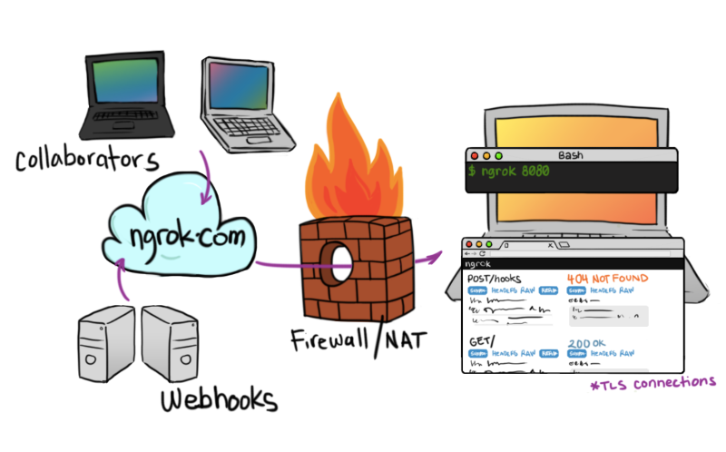

## 使用场景

> 公司A是一家服务提供商，公司B是一家知名企业。  
> 现在公司B中的一个软件服务出现了故障，需要公司A的专业人员来排查。由于两家公司相隔甚远，他们采用了远程排查方案。但是公司B的这个软件部署在内网环境的机器C上，层层网关以及种种原因（和谐部分）导致无法将机器C映射到公司B的公网端口。为了解决这种需要打通从一个局域网到另外一个局域网的网络通路，我们叫它‘内网穿透’。

总所周知，处在同一个局域网的所有机器是可以互通的，而不同局域网中的机器是无法跨域访问的。解决这种问题，我能想到的有：

1. 交换机和路由
2. 使用公网VPN服务器
3. 使用内网穿透服务器

配置交换机和路由往往非常复杂，遇到复杂的组网环境，还是杀了我吧！

公网VPN服务器我也试过了，使用简单，但是稳定性得不到保证。

所以我最终尝试了内网穿透服务器：Ngrok。（当然还有别的比如：frp）

<!---more--->

## Ngrok简介

Ngrok是一款使用GO语言开发的开源软件（仅针对1.x，2.x不开源），是一个反向代理软件。它可以在你本地运行的服务和公网服务器端点建立一条安全的隧道，这样任何一个和公网连通的客户端都可以访问和使用你的本地服务。Ngrok还可以捕获和分析所有通道上的流量，对后期的分析和处理也有相当好的支持。



Ngrok的git仓库地址：[https://github.com/inconshreveable/ngrok](https://github.com/inconshreveable/ngrok)

## 需要的宝贝

### 云服务器（有公网IP的服务器）

> 提供这种服务的像阿里云/腾讯云/百度云等等，随便挑

### 域名

> 随便什么域名，只要是你的域名，你能对其配置解析（最好能泛解析）。


## 环境要求

### Linux服务器：CentOS、Ubuntu

```bash
#centos
yum -y install zlib-devel openssl-devel perl hg cpio expat-devel gettext-devel curl curl-devel perl-ExtUtils-MakeMaker hg wget gcc gcc-c++ git golang

#ubuntu
#自行对应缺啥用'apt-get'补啥，openssl golang make 等等的都得有
```

## 安装服务器

### 克隆Ngrok到本地

```bash
git clone https://github.com/inconshreveable/ngrok.git
```

### 制作和生成证书

```bash
cd ngrok
mkdir cert
cd cert
NGROK_DOMAIN="ngrok.imsry.cn"
openssl genrsa -out base.key 2048
openssl req -new -x509 -nodes -key base.key -days 10000 -subj "/CN=$NGROK_DOMAIN" -out base.pem
openssl genrsa -out server.key 2048
openssl req -new -key server.key -subj "/CN=$NGROK_DOMAIN" -out server.csr
openssl x509 -req -in server.csr -CA base.pem -CAkey base.key -CAcreateserial -days 10000 -out server.crt
```

### 覆盖证书到Ngrok中

```bash
cp base.pem ../ngrok/assets/client/tls/ngrokroot.crt
cp server.crt ../ngrok/assets/server/tls/snakeoil.crt
cp server.key ../ngrok/assets/server/tls/snakeoil.key
```

### 编译生成Ngrok服务端

```bash
cd ../ngrok
GOOS=linux GOARCH=amd64 make release-server
```

### 启动和运行服务端(可以写成bash脚本)

```bash
./bin/ngrokd -tlsKey="assets/server/tls/snakeoil.key" -tlsCrt="assets/server/tls/snakeoil.crt" -domain="ngrok.imsry.cn"  -httpAddr=":8081" -httpsAddr=":8082" -tunnelAddr=":8083"

#参数说明：
#-domain 访问ngrok是所设置的服务地址生成证书时那个
#-httpAddr http协议端口 默认为80
#-httpsAddr https协议端口 默认为443 （可配置https证书）
#-tunnelAddr 通道端口 默认4443
```

### 客户端的编译和使用

```bash
#window-64bit如下：
GOOS=windows GOARCH=amd64 make release-client
#编译成功后会在ngrok/bin/下面生成一个windows_amd64目录下面有ngrok.exe

#Linux 平台 32 位系统：GOOS=linux GOARCH=386
#Linux 平台 64 位系统：GOOS=linux GOARCH=amd64
#Windows 平台 32 位系统：GOOS=windows GOARCH=386
#Windows 平台 64 位系统：GOOS=windows GOARCH=amd64
#MAC 平台 32 位系统：GOOS=darwin GOARCH=386
#MAC 平台 64 位系统：GOOS=darwin GOARCH=amd64
#ARM 平台：GOOS=linux GOARCH=arm
```

### 编写配置文件ngrok.cfg

```yaml
server_addr: "ngrok.imsry.cn:8083"
trust_host_root_certs: false

tunnels:
  http:
    subdomain: "test"
    proto:
      http: "80"
      
  https:
    subdomain: "test"
    proto:
      https: "443"

  tcp:
    remote_port: 5555
    proto:
      tcp: "8001"
 
  ssh:
    remote_port: 2222
    proto:
      tcp: "22"
```

### 启动客户端

```bash
./ngrok -config=ngrok.cfg start-all #启动所有服务

./ngrok -config=ngrok.cfg start ssh #启动SSH服务
./ngrok -config=ngrok.cfg start ssh http #启动SSH和HTTP服务
```

出现下面内容，表示链接成功：

```Bash
ngrok

Tunnel Status                 online
Version                       1.7/1.7
Forwarding                    http://test.ngrok.imsry.cn8081 -> 127.0.0.1:80
Forwarding                    https://test.ngrok.imsry.cn:8082 -> 127.0.0.1:443
Forwarding                    tcp://test.ngrok.imsry.cn:5555 -> 127.0.0.1:8001
Forwarding                    tcp://test.ngrok.imsry.cn:2222 -> 127.0.0.1:22
Web Interface                 127.0.0.1:4040
# Conn                        0
Avg Conn Time                 0.00ms
```

### 开始访问你的服务吧！

> 直接访问上面的地址就能取得相应的服务  
> 如果是ssh和tcp的话，直接使用如：ssh anthony@ngrok.imsry.cn -p 2222


