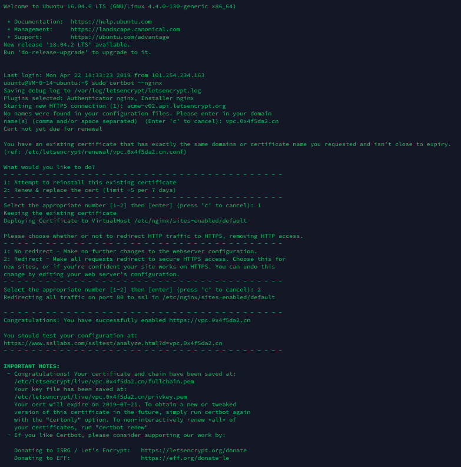

- 使用工具：CertBot https://certbot.eff.org
- Github地址：https://github.com/certbot/certbot

### 第一步，安装certbot

MacOS版本：

```bash
brew install certbot
```

Ubuntu版本：

```bash
sudo apt-get update
sudo apt-get install software-properties-common
sudo add-apt-repository universe
sudo add-apt-repository ppa:certbot/certbot
sudo apt-get update
sudo apt-get install certbot python-certbot-nginx 
```

### 第二步，运行certbot

#### type-1.仅仅制作证书

```Bash
sudo certbot --nginx certonly
```

#### type-2.和nginx并用，一键部署

```bash
sudo certbot --nginx
```

根据提示，一步一步进行：（如果是Apache，则将`nginx`替换成`apache`即可）

```bash
sudo certbot --nginx certonly
```

输入邮箱地址

```bash
Enter email address (used for urgent renewal and security notices) (Enter 'c' to
cancel): smoothest@yeah.net
```

同意服务条款

```bash
...
(A)gree/(C)ancel: A
```

接受Email通知推送

```bash
...
(Y)es/(N)o: Y
```

输入域名或者Nginx已存在的Server配置编号（我这里nignx没配置过，所以不显示有编号的列表）

```bash
No names were found in your configuration files. Please enter in your domain
name(s) (comma and/or space separated)  (Enter 'c' to cancel): vpc.0x4f5da2.cn
```

证书制作完毕！

证书位置：`/etc/letsencrypt/live/vpc.0x4f5da2.cn/fullchain.pem`

私钥位置：`/etc/letsencrypt/live/vpc.0x4f5da2.cn/privkey.pem`

`我的执行Log:`

```Plain
ubuntu@VM-0-14-ubuntu:~$ sudo certbot --nginx certonly
Saving debug log to /var/log/letsencrypt/letsencrypt.log
Plugins selected: Authenticator nginx, Installer nginx
Enter email address (used for urgent renewal and security notices) (Enter 'c' to
cancel): smoothest@yeah.net
Starting new HTTPS connection (1): acme-v02.api.letsencrypt.org

- - - - - - - - - - - - - - - - - - - - - - - - - - - - - - - - - - - - - - - -
Please read the Terms of Service at
https://letsencrypt.org/documents/LE-SA-v1.2-November-15-2017.pdf. You must
agree in order to register with the ACME server at
https://acme-v02.api.letsencrypt.org/directory
- - - - - - - - - - - - - - - - - - - - - - - - - - - - - - - - - - - - - - - -
(A)gree/(C)ancel: A

- - - - - - - - - - - - - - - - - - - - - - - - - - - - - - - - - - - - - - - -
Would you be willing to share your email address with the Electronic Frontier
Foundation, a founding partner of the Let's Encrypt project and the non-profit
organization that develops Certbot? We'd like to send you email about our work
encrypting the web, EFF news, campaigns, and ways to support digital freedom.
- - - - - - - - - - - - - - - - - - - - - - - - - - - - - - - - - - - - - - - -
(Y)es/(N)o: N
No names were found in your configuration files. Please enter in your domain
name(s) (comma and/or space separated)  (Enter 'c' to cancel): vpc.0x4f5da2.cn
Obtaining a new certificate
Performing the following challenges:
http-01 challenge for vpc.0x4f5da2.cn
Waiting for verification...
Cleaning up challenges
Resetting dropped connection: acme-v02.api.letsencrypt.org

IMPORTANT NOTES:
 - Congratulations! Your certificate and chain have been saved at:
   /etc/letsencrypt/live/vpc.0x4f5da2.cn/fullchain.pem
   Your key file has been saved at:
   /etc/letsencrypt/live/vpc.0x4f5da2.cn/privkey.pem
   Your cert will expire on 2019-07-21. To obtain a new or tweaked
   version of this certificate in the future, simply run certbot
   again. To non-interactively renew *all* of your certificates, run
   "certbot renew"
 - Your account credentials have been saved in your Certbot
   configuration directory at /etc/letsencrypt. You should make a
   secure backup of this folder now. This configuration directory will
   also contain certificates and private keys obtained by Certbot so
   making regular backups of this folder is ideal.
 - If you like Certbot, please consider supporting our work by:

   Donating to ISRG / Let's Encrypt:   https://letsencrypt.org/donate
   Donating to EFF:                    https://eff.org/donate-le
```

### 第三步，续期（证书过期前需执行）

Let's Encrypt提供的证书默认只有90天有效期，所以咱们必须在过期之前重新对证书进行续期。

对证书续期也十分的便利，直接再执行一下之前的命令，它会检测到并提示你进行相关操作。

以下是我的测试Log：（因为刚生成证书，我选择了第一项：重新安装证书。第二项是续期！）

