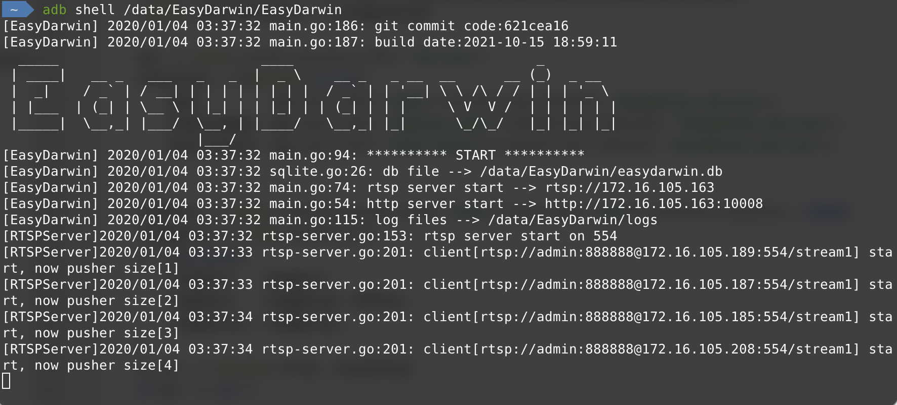
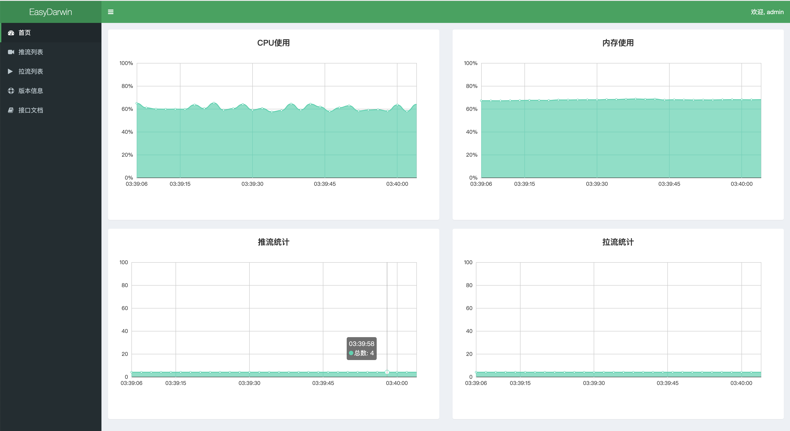

## 前言

本次遇到的项目是[EasyDarwin](https://github.com/EasyDarwin/EasyDarwin)，一个基于Go语言研发和维护的高性能RTSP流媒体服务器。我的目标是能够让其运行在创通联达*Thundercomm*推出的TurboX C610开发板上，开发板支持纯Linux系统和Android10，因为需要在开发板上实现本地播放视频流，所以本次编译的目标系统是安卓（其实二者对编译影响不大）。

编译平台：

* MacBook Pro（Big Sur 11.6）
* 处理器：2.6 GHz 六核Intel Core i7
* 内存：16 GB 2667 MHz DDR4

目标平台：

```bash
$> getprop ro.product.cpu.abi
arm64-v8a
$> uname -a
Linux localhost 4.14.117+ #1 SMP PREEMPT Sun Sep 26 19:31:44 CST 2021 aarch64
$> cat /proc/version
Linux version 4.14.117+ (cocafe@ubuntu-v3-rocket) (clang version 8.0.12 for Android NDK) #1 SMP PREEMPT Sun Sep 26 19:31:44 CST 2021
$> cat /proc/cpuinfo
Processor	: AArch64 Processor rev 14 (aarch64)
processor	: 0
BogoMIPS	: 38.40
Features	: fp asimd evtstrm aes pmull sha1 sha2 crc32 atomics fphp asimdhp cpuid asimdrdm lrcpc dcpop asimddp
CPU implementer	: 0x51
CPU architecture: 8
CPU variant	: 0xd
CPU part	: 0x805
CPU revision	: 14
# 此处省略6个...
processor	: 7
BogoMIPS	: 38.40
Features	: fp asimd evtstrm aes pmull sha1 sha2 crc32 atomics fphp asimdhp cpuid asimdrdm lrcpc dcpop asimddp
CPU implementer	: 0x51
CPU architecture: 8
CPU variant	: 0xd
CPU part	: 0x804
CPU revision	: 14

Hardware	: Qualcomm Technologies, Inc QCS610
```


先后也尝试过在Window和docker(alpha go & Ubuntu 18.04)上编译，均没有成功，最后还是在我的笔记本上解决了，所以这里就记录一下这个解决过程。

## 一、Clone项目

根据项目说明，先获取项目代码：

```bash
cd $GOPATH/src/github.com
mkdir EasyDarwin && cd EasyDarwin
git clone https://github.com/EasyDarwin/EasyDarwin.git --depth=1 EasyDarwin
cd EasyDarwin
```

项目的根目录文件如下：

```bash
 ~/Workspaces/GoPath/src/github.com/EasyDarwin/EasyDarwin   master  ls -lrt
total 9944
-rw-r--r--   1 anthony  staff     1410 10 18 10:29 EasyDarwin_windows.syso
-rw-r--r--   1 anthony  staff     3283 10 18 10:29 README.md
-rw-r--r--   1 anthony  staff  2525696 10 18 10:29 ServiceInstall-EasyDarwin.exe
-rw-r--r--   1 anthony  staff  2525696 10 18 10:29 ServiceUninstall-EasyDarwin.exe
-rw-r--r--   1 anthony  staff     2180 10 18 10:29 easydarwin.ini
-rw-r--r--   1 anthony  staff     1150 10 18 10:29 ed.ico
-rw-r--r--   1 anthony  staff     5473 10 18 10:29 main.go
drwxr-xr-x   5 anthony  staff      160 10 18 10:29 models
-rw-r--r--   1 anthony  staff     1878 10 18 10:29 package.json
drwxr-xr-x   8 anthony  staff      256 10 18 10:29 routers
drwxr-xr-x  15 anthony  staff      480 10 18 10:29 rtsp
-rwxr-xr-x   1 anthony  staff       92 10 18 10:29 start.sh
-rwxr-xr-x   1 anthony  staff       93 10 18 10:29 stop.sh
drwxr-xr-x   6 anthony  staff      192 10 18 10:29 vendor
drwxr-xr-x  15 anthony  staff      480 10 18 10:29 web_src
drwxr-xr-x  13 anthony  staff      416 10 18 10:29 www
```

可以看到，里面有针对Windows的服务装载和卸载程序，有前后端分离出来的web代码，还有用于在linux上装载和卸载的shell脚本。这些我们先不管，看到这里有main.go文件，先看看直接编译！

## 二、编译过程

### 直接编译

```bash
 ~/Workspaces/GoPath/src/github.com/EasyDarwin/EasyDarwin   master  go build -o EasyDarwin
go: cannot find main module, but found vendor/vendor.json in /Users/anthony/Workspaces/GoPath/src/github.com/EasyDarwin/EasyDarwin
	to create a module there, run:
	go mod init
```

报错了！错误原因是找不到相关的模块，提示发现了vendor.json，可以尝试创建模块。

```bash
 ~/Workspaces/GoPath/src/github.com/EasyDarwin/EasyDarwin > master >$ go mod init
go: creating new go.mod: module github.com/EasyDarwin/EasyDarwin
go: converting vendor/vendor.json: stat github.com/go-ini/ini@d0926230dda8c9e4e61040cb7825a026dee7d2d3: unknown revision d0926230dda8c9e4e61040cb7825a026dee7d2d3
go: converting vendor/vendor.json: stat github.com/eiannone/keyboard@d0926230dda8c9e4e61040cb7825a026dee7d2d3: unknown revision d0926230dda8c9e4e61040cb7825a026dee7d2d3
go: converting vendor/vendor.json: stat github.com/go-redis/redis@c3d6048651cd9420b049fc7ddfc232002d36e800: unknown revision c3d6048651cd9420b049fc7ddfc232002d36e800
go: converting vendor/vendor.json: stat github.com/go-redis/redis/internal@c3d6048651cd9420b049fc7ddfc232002d36e800: unknown revision c3d6048651cd9420b049fc7ddfc232002d36e800
go: converting vendor/vendor.json: stat github.com/go-redis/redis/internal/consistenthash@c3d6048651cd9420b049fc7ddfc232002d36e800: unknown revision c3d6048651cd9420b049fc7ddfc232002d36e800
go: converting vendor/vendor.json: stat github.com/go-redis/redis/internal/hashtag@c3d6048651cd9420b049fc7ddfc232002d36e800: unknown revision c3d6048651cd9420b049fc7ddfc232002d36e800
go: converting vendor/vendor.json: stat github.com/go-redis/redis/internal/pool@c3d6048651cd9420b049fc7ddfc232002d36e800: unknown revision c3d6048651cd9420b049fc7ddfc232002d36e800
go: converting vendor/vendor.json: stat github.com/go-redis/redis/internal/proto@c3d6048651cd9420b049fc7ddfc232002d36e800: unknown revision c3d6048651cd9420b049fc7ddfc232002d36e800
go: converting vendor/vendor.json: stat github.com/go-redis/redis/internal/util@c3d6048651cd9420b049fc7ddfc232002d36e800: unknown revision c3d6048651cd9420b049fc7ddfc232002d36e800
go: converting vendor/vendor.json: stat github.com/go-redis/redis/internal/singleflight@c3d6048651cd9420b049fc7ddfc232002d36e800: unknown revision c3d6048651cd9420b049fc7ddfc232002d36e800
go: converting vendor/vendor.json: stat github.com/gorilla/securecookie@c3d6048651cd9420b049fc7ddfc232002d36e800: unknown revision c3d6048651cd9420b049fc7ddfc232002d36e800
go: converting vendor/vendor.json: stat github.com/gorilla/context@c3d6048651cd9420b049fc7ddfc232002d36e800: unknown revision c3d6048651cd9420b049fc7ddfc232002d36e800
go: converting vendor/vendor.json: stat github.com/gorilla/sessions@c3d6048651cd9420b049fc7ddfc232002d36e800: unknown revision c3d6048651cd9420b049fc7ddfc232002d36e800
go: converting vendor/vendor.json: stat github.com/jinzhu/gorm/dialects/sqlite@d0926230dda8c9e4e61040cb7825a026dee7d2d3: unknown revision d0926230dda8c9e4e61040cb7825a026dee7d2d3
go: converting vendor/vendor.json: stat github.com/lestrrat-go/file-rotatelogs@d0926230dda8c9e4e61040cb7825a026dee7d2d3: unknown revision d0926230dda8c9e4e61040cb7825a026dee7d2d3
go: converting vendor/vendor.json: stat github.com/lestrrat-go/file-rotatelogs/internal/option@d0926230dda8c9e4e61040cb7825a026dee7d2d3: unknown revision d0926230dda8c9e4e61040cb7825a026dee7d2d3
go: converting vendor/vendor.json: stat github.com/mattn/go-sqlite3@d0926230dda8c9e4e61040cb7825a026dee7d2d3: unknown revision d0926230dda8c9e4e61040cb7825a026dee7d2d3
go: converting vendor/vendor.json: stat github.com/lestrrat-go/strftime@d0926230dda8c9e4e61040cb7825a026dee7d2d3: unknown revision d0926230dda8c9e4e61040cb7825a026dee7d2d3
go: converting vendor/vendor.json: stat github.com/penggy/EasyGoLib/db@d0926230dda8c9e4e61040cb7825a026dee7d2d3: git fetch -f origin refs/heads/*:refs/heads/* refs/tags/*:refs/tags/* in /Users/anthony/Workspaces/GoPath/pkg/mod/cache/vcs/33f838a753e8fa7eab63e13398d4a274aa8b91dc573e2ab4195d68907e5d3305: exit status 128:
	fatal: could not read Username for 'https://github.com': terminal prompts disabled
go: converting vendor/vendor.json: stat github.com/pkg/errors@d0926230dda8c9e4e61040cb7825a026dee7d2d3: unknown revision d0926230dda8c9e4e61040cb7825a026dee7d2d3
go: converting vendor/vendor.json: stat github.com/penggy/EasyGoLib/utils@c61bc7ee568dd64a40f19ff44e32db22134226d9: git fetch -f origin refs/heads/*:refs/heads/* refs/tags/*:refs/tags/* in /Users/anthony/Workspaces/GoPath/pkg/mod/cache/vcs/33f838a753e8fa7eab63e13398d4a274aa8b91dc573e2ab4195d68907e5d3305: exit status 128:
	fatal: could not read Username for 'https://github.com': terminal prompts disabled
go: converting vendor/vendor.json: stat github.com/penggy/sessions@c3d6048651cd9420b049fc7ddfc232002d36e800: git fetch -f origin refs/heads/*:refs/heads/* refs/tags/*:refs/tags/* in /Users/anthony/Workspaces/GoPath/pkg/mod/cache/vcs/e4e0a9ef39fd42fbd44ddf37bd1c39fe9005b110f5974ee01a90be0a8cb82b27: exit status 128:
	fatal: could not read Username for 'https://github.com': terminal prompts disabled
go: converting vendor/vendor.json: stat github.com/penggy/service@cab262f1f320bfa9ba0e9b40388ae9e09adc9692: git fetch -f origin refs/heads/*:refs/heads/* refs/tags/*:refs/tags/* in /Users/anthony/Workspaces/GoPath/pkg/mod/cache/vcs/2f018279b22aa607c613f2ff23b2c95fdfb3ce385f093e56e041520af9ae9744: exit status 128:
	fatal: could not read Username for 'https://github.com': terminal prompts disabled
go: converting vendor/vendor.json: stat golang.org/x/sys/windows/svc@cab262f1f320bfa9ba0e9b40388ae9e09adc9692: unknown revision cab262f1f320bfa9ba0e9b40388ae9e09adc9692
go: converting vendor/vendor.json: stat golang.org/x/sys/windows/registry@cab262f1f320bfa9ba0e9b40388ae9e09adc9692: unknown revision cab262f1f320bfa9ba0e9b40388ae9e09adc9692
go: converting vendor/vendor.json: stat golang.org/x/sys/windows/svc/eventlog@cab262f1f320bfa9ba0e9b40388ae9e09adc9692: unknown revision cab262f1f320bfa9ba0e9b40388ae9e09adc9692
go: converting vendor/vendor.json: stat golang.org/x/sys/windows/svc/mgr@cab262f1f320bfa9ba0e9b40388ae9e09adc9692: unknown revision cab262f1f320bfa9ba0e9b40388ae9e09adc9692
go: converting vendor/vendor.json: stat golang.org/x/sys/windows@753144271b444787650750f626cc62831f63bc9c: unknown revision 753144271b444787650750f626cc62831f63bc9c
go: converting vendor/vendor.json: stat golang.org/x/sys/unix@753144271b444787650750f626cc62831f63bc9c: unknown revision 753144271b444787650750f626cc62831f63bc9c
go: copying requirements from vendor/vendor.json
go: to add module requirements and sums:
	go mod tidy
```

根据提示，执行`go mod tidy`来添加依赖：

```bash
 ~/Workspaces/GoPath/src/github.com/EasyDarwin/EasyDarwin > master >$ go mod tidy
go: finding module for package github.com/penggy/service
go: finding module for package github.com/stretchr/testify/assert
go: finding module for package golang.org/x/net/context
go: finding module for package github.com/denisenkom/go-mssqldb
go: finding module for package github.com/erikstmartin/go-testdb
go: finding module for package github.com/penggy/EasyGoLib/db
go: finding module for package gopkg.in/go-playground/assert.v1
go: finding module for package github.com/jinzhu/now
go: finding module for package golang.org/x/sys/unix
go: finding module for package golang.org/x/sys/windows
go: finding module for package github.com/penggy/sessions
go: finding module for package github.com/penggy/EasyGoLib/utils
go: finding module for package github.com/go-sql-driver/mysql
go: downloading golang.org/x/sys v0.0.0-20211015200801-69063c4bb744
go: finding module for package github.com/lib/pq
go: downloading github.com/stretchr/testify v1.7.0
go: downloading golang.org/x/net v0.0.0-20211015210444-4f30a5c0130f
go: downloading github.com/jinzhu/now v1.1.2
go: downloading github.com/denisenkom/go-mssqldb v0.11.0
go: finding module for package github.com/lib/pq/hstore
go: finding module for package github.com/mattn/go-sqlite3
go: finding module for package golang.org/x/sync/errgroup
go: finding module for package github.com/stretchr/testify/require
go: downloading github.com/go-sql-driver/mysql v1.6.0
go: downloading github.com/lib/pq v1.10.3
go: found golang.org/x/sys/unix in golang.org/x/sys v0.0.0-20211015200801-69063c4bb744
go: found golang.org/x/sys/windows in golang.org/x/sys v0.0.0-20211015200801-69063c4bb744
go: found github.com/erikstmartin/go-testdb in github.com/erikstmartin/go-testdb v0.0.0-20160219214506-8d10e4a1bae5
go: found github.com/jinzhu/now in github.com/jinzhu/now v1.1.2
go: found github.com/stretchr/testify/assert in github.com/stretchr/testify v1.7.0
go: found golang.org/x/net/context in golang.org/x/net v0.0.0-20211015210444-4f30a5c0130f
go: found gopkg.in/go-playground/assert.v1 in gopkg.in/go-playground/assert.v1 v1.2.1
go: found github.com/denisenkom/go-mssqldb in github.com/denisenkom/go-mssqldb v0.11.0
go: found github.com/go-sql-driver/mysql in github.com/go-sql-driver/mysql v1.6.0
go: found github.com/lib/pq in github.com/lib/pq v1.10.3
go: found github.com/lib/pq/hstore in github.com/lib/pq v1.10.3
go: found github.com/mattn/go-sqlite3 in github.com/mattn/go-sqlite3 v1.14.8
go: found golang.org/x/sync/errgroup in golang.org/x/sync v0.0.0-20210220032951-036812b2e83c
go: found github.com/stretchr/testify/require in github.com/stretchr/testify v1.7.0
go: downloading gopkg.in/yaml.v3 v3.0.0-20200313102051-9f266ea9e77c
go: downloading golang.org/x/crypto v0.0.0-20190325154230-a5d413f7728c
go: finding module for package github.com/penggy/sessions
go: finding module for package github.com/penggy/service
go: finding module for package github.com/penggy/EasyGoLib/db
go: finding module for package github.com/penggy/EasyGoLib/utils
github.com/EasyDarwin/EasyDarwin imports
	github.com/penggy/EasyGoLib/db: cannot find module providing package github.com/penggy/EasyGoLib/db: module github.com/penggy/EasyGoLib/db: git ls-remote -q origin in /Users/anthony/Workspaces/GoPath/pkg/mod/cache/vcs/33f838a753e8fa7eab63e13398d4a274aa8b91dc573e2ab4195d68907e5d3305: exit status 128:
	fatal: could not read Username for 'https://github.com': terminal prompts disabled
Confirm the import path was entered correctly.
If this is a private repository, see https://golang.org/doc/faq#git_https for additional information.
github.com/EasyDarwin/EasyDarwin imports
	github.com/penggy/EasyGoLib/utils: cannot find module providing package github.com/penggy/EasyGoLib/utils: module github.com/penggy/EasyGoLib/utils: git ls-remote -q origin in /Users/anthony/Workspaces/GoPath/pkg/mod/cache/vcs/33f838a753e8fa7eab63e13398d4a274aa8b91dc573e2ab4195d68907e5d3305: exit status 128:
	fatal: could not read Username for 'https://github.com': terminal prompts disabled
Confirm the import path was entered correctly.
If this is a private repository, see https://golang.org/doc/faq#git_https for additional information.
github.com/EasyDarwin/EasyDarwin imports
	github.com/penggy/service: cannot find module providing package github.com/penggy/service: module github.com/penggy/service: git ls-remote -q origin in /Users/anthony/Workspaces/GoPath/pkg/mod/cache/vcs/2f018279b22aa607c613f2ff23b2c95fdfb3ce385f093e56e041520af9ae9744: exit status 128:
	fatal: could not read Username for 'https://github.com': terminal prompts disabled
Confirm the import path was entered correctly.
If this is a private repository, see https://golang.org/doc/faq#git_https for additional information.
github.com/EasyDarwin/EasyDarwin/routers imports
	github.com/penggy/sessions: cannot find module providing package github.com/penggy/sessions: module github.com/penggy/sessions: git ls-remote -q origin in /Users/anthony/Workspaces/GoPath/pkg/mod/cache/vcs/e4e0a9ef39fd42fbd44ddf37bd1c39fe9005b110f5974ee01a90be0a8cb82b27: exit status 128:
	fatal: could not read Username for 'https://github.com': terminal prompts disabled
Confirm the import path was entered correctly.
If this is a private repository, see https://golang.org/doc/faq#git_https for additional information.
```

失败了！其实在上个步骤的时候就已经能够预判可能有问题了，遇到了`Fatal`错误肯定就很难继续下去，根据报错分析问题原因，可以看到重点提示是：`fatal: could not read Username for 'https://github.com': terminal prompts disabled`。大概意思是不能从终端获取用户名？为什么我下载个依赖还要我的用户名呢？然后我去看了一下都有哪些依赖报这个错误。

1. github.com/penggy/EasyGoLib/db
2. github.com/penggy/EasyGoLib/utils
3. github.com/penggy/service
4. github.com/penggy/sessions

好家伙，`penggy`提供的这个4个仓库源码均不在了！好在我搜索技能还算可以，找到了原先可用的库：

1. github.com/MeloQi/EasyGoLib/db
2. github.com/MeloQi/EasyGoLib/utils
3. github.com/MeloQi/service
4. github.com/MeloQi/sessions

然后替换整个项目中的依赖代码，我索性将所有`github.com/penggy`开头的串都替换成`github.com/MeloQi`，看看结果！

重新初始化模块以重复上述步骤：

```bash
>$ rm go.mod
>$ go mod init
>$ go mod tidy
```

一切正常没有报错了！尝试一直编译：

```bash
 ~/Workspaces/GoPath/src/github.com/EasyDarwin/EasyDarwin > master >$ go build -o EasyDarwin
go: inconsistent vendoring in /Users/anthony/Workspaces/GoPath/src/github.com/EasyDarwin/EasyDarwin:
	github.com/MeloQi/EasyGoLib@v0.0.0-20191209094052-803960583571: is explicitly required in go.mod, but not marked as explicit in vendor/modules.txt
	github.com/MeloQi/cors@v0.0.0-20191030023859-de49554d5cda: is explicitly required in go.mod, but not marked as explicit in vendor/modules.txt
	github.com/MeloQi/service@v0.0.0-20191030061151-7762127fe623: is explicitly required in go.mod, but not marked as explicit in vendor/modules.txt
	github.com/MeloQi/sessions@v0.0.0-20191030032128-1c51e5f867b9: is explicitly required in go.mod, but not marked as explicit in vendor/modules.txt
	github.com/StackExchange/wmi@v0.0.0-20180412205111-cdffdb33acae: is explicitly required in go.mod, but not marked as explicit in vendor/modules.txt
	github.com/common-nighthawk/go-figure@v0.0.0-20180619031829-18b2b544842c: is explicitly required in go.mod, but not marked as explicit in vendor/modules.txt
	github.com/denisenkom/go-mssqldb@v0.11.0: is explicitly required in go.mod, but not marked as explicit in vendor/modules.txt
	github.com/eiannone/keyboard@v0.0.0-20200508000154-caf4b762e807: is explicitly required in go.mod, but not marked as explicit in vendor/modules.txt
	github.com/erikstmartin/go-testdb@v0.0.0-20160219214506-8d10e4a1bae5: is explicitly required in go.mod, but not marked as explicit in vendor/modules.txt
	github.com/gin-contrib/pprof@v0.0.0-20180514151456-0ed7ffb6a189: is explicitly required in go.mod, but not marked as explicit in vendor/modules.txt
	github.com/gin-contrib/sse@v0.0.0-20170109093832-22d885f9ecc7: is explicitly required in go.mod, but not marked as explicit in vendor/modules.txt
	github.com/gin-contrib/static@v0.0.0-20180301030858-73da7037e716: is explicitly required in go.mod, but not marked as explicit in vendor/modules.txt
	github.com/gin-gonic/gin@v1.3.0: is explicitly required in go.mod, but not marked as explicit in vendor/modules.txt
	github.com/go-ini/ini@v1.63.2: is explicitly required in go.mod, but not marked as explicit in vendor/modules.txt
	github.com/go-ole/go-ole@v1.2.2-0.20180213002836-a1ec82a652eb: is explicitly required in go.mod, but not marked as explicit in vendor/modules.txt
	github.com/go-redis/redis@v6.15.9+incompatible: is explicitly required in go.mod, but not marked as explicit in vendor/modules.txt
	github.com/go-sql-driver/mysql@v1.6.0: is explicitly required in go.mod, but not marked as explicit in vendor/modules.txt
	github.com/gorilla/context@v1.1.1: is explicitly required in go.mod, but not marked as explicit in vendor/modules.txt
	github.com/gorilla/sessions@v1.2.1: is explicitly required in go.mod, but not marked as explicit in vendor/modules.txt
	github.com/jinzhu/gorm@v1.9.2-0.20180512062900-82eb9f8a5bbb: is explicitly required in go.mod, but not marked as explicit in vendor/modules.txt
	github.com/jinzhu/inflection@v0.0.0-20180308033659-04140366298a: is explicitly required in go.mod, but not marked as explicit in vendor/modules.txt
	github.com/jinzhu/now@v1.1.2: is explicitly required in go.mod, but not marked as explicit in vendor/modules.txt
	github.com/jonboulle/clockwork@v0.2.2: is explicitly required in go.mod, but not marked as explicit in vendor/modules.txt
	github.com/json-iterator/go@v0.0.0-20180424004623-2ddf6d758266: is explicitly required in go.mod, but not marked as explicit in vendor/modules.txt
	github.com/lestrrat-go/file-rotatelogs@v2.4.0+incompatible: is explicitly required in go.mod, but not marked as explicit in vendor/modules.txt
	github.com/lestrrat-go/strftime@v1.0.5: is explicitly required in go.mod, but not marked as explicit in vendor/modules.txt
	github.com/lib/pq@v1.10.3: is explicitly required in go.mod, but not marked as explicit in vendor/modules.txt
	github.com/mattn/go-isatty@v0.0.4: is explicitly required in go.mod, but not marked as explicit in vendor/modules.txt
	github.com/mattn/go-sqlite3@v1.14.8: is explicitly required in go.mod, but not marked as explicit in vendor/modules.txt
	github.com/modern-go/concurrent@v0.0.0-20180306012644-bacd9c7ef1dd: is explicitly required in go.mod, but not marked as explicit in vendor/modules.txt
	github.com/modern-go/reflect2@v0.0.0-20180511053014-58118c1ea916: is explicitly required in go.mod, but not marked as explicit in vendor/modules.txt
	github.com/onsi/ginkgo@v1.16.5: is explicitly required in go.mod, but not marked as explicit in vendor/modules.txt
	github.com/onsi/gomega@v1.16.0: is explicitly required in go.mod, but not marked as explicit in vendor/modules.txt
	github.com/pixelbender/go-sdp@v0.0.0-20181123094152-100bc9371a0c: is explicitly required in go.mod, but not marked as explicit in vendor/modules.txt
	github.com/pkg/errors@v0.9.1: is explicitly required in go.mod, but not marked as explicit in vendor/modules.txt
	github.com/shirou/gopsutil@v2.17.13-0.20180417021151-63047d776e07+incompatible: is explicitly required in go.mod, but not marked as explicit in vendor/modules.txt
	github.com/stretchr/testify@v1.7.0: is explicitly required in go.mod, but not marked as explicit in vendor/modules.txt
	github.com/teris-io/shortid@v0.0.0-20171029131806-771a37caa5cf: is explicitly required in go.mod, but not marked as explicit in vendor/modules.txt
	github.com/ugorji/go@v0.0.0-20180307152341-02537d3a3e32: is explicitly required in go.mod, but not marked as explicit in vendor/modules.txt
	golang.org/x/net@v0.0.0-20211015210444-4f30a5c0130f: is explicitly required in go.mod, but not marked as explicit in vendor/modules.txt
	golang.org/x/sys@v0.0.0-20211015200801-69063c4bb744: is explicitly required in go.mod, but not marked as explicit in vendor/modules.txt
	gopkg.in/go-playground/assert.v1@v1.2.1: is explicitly required in go.mod, but not marked as explicit in vendor/modules.txt
	gopkg.in/go-playground/validator.v8@v8.18.2: is explicitly required in go.mod, but not marked as explicit in vendor/modules.txt

	To ignore the vendor directory, use -mod=readonly or -mod=mod.
	To sync the vendor directory, run:
		go mod vendor
```

整个问题好解决，根据提示更新一下vendor目录：

```bash
>$ go mod vendor
>$ go build -o EasyDarwin
```

```bash
./EasyDarwin
[EasyDarwin] 2021/10/18 11:05:39 main.go:186: git commit code:
[EasyDarwin] 2021/10/18 11:05:39 main.go:187: build date:
  _____                         ____                              _
 | ____|   __ _   ___   _   _  |  _ \    __ _   _ __  __      __ (_)  _ __
 |  _|    / _` | / __| | | | | | | | |  / _` | | '__| \ \ /\ / / | | | '_ \
 | |___  | (_| | \__ \ | |_| | | |_| | | (_| | | |     \ V  V /  | | | | | |
 |_____|  \__,_| |___/  \__, | |____/   \__,_| |_|      \_/\_/   |_| |_| |_|
                        |___/
[EasyDarwin] 2021/10/18 11:05:39 main.go:94: ********** START **********
[EasyDarwin] 2021/10/18 11:05:39 sqlite.go:26: db file --> /Users/anthony/Workspaces/GoPath/src/github.com/EasyDarwin/EasyDarwin/easydarwin.db
[EasyDarwin] 2021/10/18 11:05:39 main.go:74: rtsp server start --> rtsp://192.168.123.142
[EasyDarwin] 2021/10/18 11:05:39 main.go:54: http server start --> http://192.168.123.142:10008
[RTSPServer]2021/10/18 11:05:39 rtsp-server.go:153: rtsp server start on 554
[EasyDarwin] 2021/10/18 11:05:39 main.go:129: demon pull streams
```

本机成功运行！

### 交叉编译（gox）

现在尝试用屡试不爽的交叉编译工具：`github.com/mitchellh/gox`，这个我已经用了很久了，安装方式很简单：`go get github.com/mitchellh/gox`

```bash
$> gox -osarch="linux/arm64"
Number of parallel builds: 11

-->     linux/arm64: github.com/EasyDarwin/EasyDarwin

1 errors occurred:
--> linux/arm64 error: exit status 2
Stderr: # github.com/MeloQi/EasyGoLib/utils
vendor/github.com/MeloQi/EasyGoLib/utils/log_linux.go:14:8: undefined: syscall.Dup2
```

`syscall.Dup2`方法未定义？通过查询资料（[链接](https://blog.csdn.net/EasyGBS/article/details/110137613)），Arm没有实现Dup2，但是有提供Dup3。话不多少，暴力改码：

```bash
$> vim vendor/github.com/MeloQi/EasyGoLib/utils/log_linux.go
# 如下修改
14c14
< 	err = syscall.Dup2(int(logFile.Fd()), int(os.Stderr.Fd()))
---
> 	err = syscall.Dup3(int(logFile.Fd()), int(os.Stderr.Fd()), 0)
```

重新执行`gox -osarch="linux/arm64"`，成功生成了一个二进制文件`EasyDarwin_linux_arm64`。

放到开发板上去运行一下看看：

```bash
$> adb push EasyDarwin_linux_arm64 /data/
$> adb shell /data/EasyDarwin_linux_arm64
[EasyDarwin] 2020/01/04 00:44:49 main.go:186: git commit code:
[EasyDarwin] 2020/01/04 00:44:49 main.go:187: build date:
  _____                         ____                              _
 | ____|   __ _   ___   _   _  |  _ \    __ _   _ __  __      __ (_)  _ __
 |  _|    / _` | / __| | | | | | | | |  / _` | | '__| \ \ /\ / / | | | '_ \
 | |___  | (_| | \__ \ | |_| | | |_| | | (_| | | |     \ V  V /  | | | | | |
 |_____|  \__,_| |___/  \__, | |____/   \__,_| |_|      \_/\_/   |_| |_| |_|
                        |___/
[EasyDarwin] 2020/01/04 00:44:49 main.go:94: ********** START **********
[EasyDarwin] 2020/01/04 00:44:49 sqlite.go:26: db file --> /data/easydarwin_linux_arm64.db
[EasyDarwin] 2020/01/04 00:44:49 main.go:225: Binary was compiled with 'CGO_ENABLED=0', go-sqlite3 requires cgo to work. This is a stub
[EasyDarwin] 2020/01/04 00:44:49 utils.go:277: Press any to exit
```

Ops！又报错了，原因提示的很明确，编译时没有`CGO_ENABLED=1`，因为用到的依赖库`go-sqlite3`需要cgo去运行。那么我们加上`cgo`的支持：

```bash
$> gox -osarch="linux/arm64" -cgo=true
Number of parallel builds: 11

-->     linux/arm64: github.com/EasyDarwin/EasyDarwin

1 errors occurred:
--> linux/arm64 error: exit status 2
Stderr: # runtime/cgo
linux_syscall.c:67:13: error: implicit declaration of function 'setresgid' is invalid in C99 [-Werror,-Wimplicit-function-declaration]
linux_syscall.c:67:13: note: did you mean 'setregid'?
/Library/Developer/CommandLineTools/SDKs/MacOSX.sdk/usr/include/unistd.h:593:6: note: 'setregid' declared here
linux_syscall.c:73:13: error: implicit declaration of function 'setresuid' is invalid in C99 [-Werror,-Wimplicit-function-declaration]
linux_syscall.c:73:13: note: did you mean 'setreuid'?
/Library/Developer/CommandLineTools/SDKs/MacOSX.sdk/usr/include/unistd.h:595:6: note: 'setreuid' declared here
```

新的错误发生了，不慌， 根据错误信息去排查。这里面的报错类型：`-Werror,-Wimplicit-function-declaration`两种，`gox`貌似没有提供忽略报错的方法，那么就换编译方式，`xgo`我也试过，也不好使，这里就不过多阐述了。

用最原始的交叉编译方式：

```bash
$> CGO_ENABLED=1 GOOS=linux GOARCH=arm64 go build -a
# runtime/cgo
linux_syscall.c:67:13: error: implicit declaration of function 'setresgid' is invalid in C99 [-Werror,-Wimplicit-function-declaration]
linux_syscall.c:67:13: note: did you mean 'setregid'?
/Library/Developer/CommandLineTools/SDKs/MacOSX.sdk/usr/include/unistd.h:593:6: note: 'setregid' declared here
linux_syscall.c:73:13: error: implicit declaration of function 'setresuid' is invalid in C99 [-Werror,-Wimplicit-function-declaration]
linux_syscall.c:73:13: note: did you mean 'setreuid'?
/Library/Developer/CommandLineTools/SDKs/MacOSX.sdk/usr/include/unistd.h:595:6: note: 'setreuid' declared here
```

同样的报错，如何解决？

```bash
$> CGO_ENABLED=1 GOOS=linux GOARCH=arm64 CGO_CFLAGS="-Wno-error -Wno-implicit-function-declaration" go build -a -o EasyDawrwin_cross
# runtime/cgo
linux_syscall.c:67:13: error: implicit declaration of function 'setresgid' is invalid in C99 [-Werror,-Wimplicit-function-declaration]
linux_syscall.c:67:13: note: did you mean 'setregid'?
/Library/Developer/CommandLineTools/SDKs/MacOSX.sdk/usr/include/unistd.h:593:6: note: 'setregid' declared here
linux_syscall.c:73:13: error: implicit declaration of function 'setresuid' is invalid in C99 [-Werror,-Wimplicit-function-declaration]
linux_syscall.c:73:13: note: did you mean 'setreuid'?
/Library/Developer/CommandLineTools/SDKs/MacOSX.sdk/usr/include/unistd.h:595:6: note: 'setreuid' declared here
# 还是无法解决
```

既然是如此如此，这般这般，那么我只好寻找交叉编译工具链了。通过上网百度搜索，一大堆资料提供了一大堆工具链，有：

1. https://releases.linaro.org/components/toolchain/binaries/
2. https://snapshots.linaro.org/gnu-toolchain/
3. https://github.com/FiloSottile/homebrew-musl-cross
4. https://github.com/messense/homebrew-macos-cross-toolchains

经过漫长的尝试，最终我在使用第四个[homebrew-macos-cross-toolchains](https://github.com/messense/homebrew-macos-cross-toolchains)安装的`gcc`和`g++`可以编译出来可运行的程序。

```bash
# 添加软件源
$> brew tap messense/macos-cross-toolchains
# 安装arrch64的编译工具链
$> brew install aarch64-unknown-linux-gnu
```

再次尝试交叉编译：

```bash
$> CC=/usr/local/Cellar/aarch64-unknown-linux-gnu/10.3.0/bin/aarch64-unknown-linux-gnu-gcc CXX=/usr/local/Cellar/aarch64-unknown-linux-gnu/10.3.0/bin/aarch64-unknown-linux-gnu-g++ CGO_ENABLED=1 GOOS=linux GOARCH=arm64 go build -a -o EasyDarwin_cross
# 上传并运行
$> adb push EasyDarwin_cross /data/
$> adb shell /data/EasyDarwin_cross
/system/bin/sh: /data/EasyDarwin_cross: No such file or directory
```

文件明明传上去了，也核对了文件权限(777)，为啥提示文件不存在呢？通过继续[查资料](https://blog.csdn.net/dq5070410/article/details/51723014)了解到可能是缺少某些基础依赖的缺失，没办法，最后直接通过暴力解决方案：`完全打包`。顾名思义，就是编译的出来的软件自身包含了一切运行时所需的依赖！虽然这样会使文件变大，但是针对解决问题还是比较快的。

```bash
# 加上CGO_LDFLAGS="-static"
$> CC=/usr/local/Cellar/aarch64-unknown-linux-gnu/10.3.0/bin/aarch64-unknown-linux-gnu-gcc CXX=/usr/local/Cellar/aarch64-unknown-linux-gnu/10.3.0/bin/aarch64-unknown-linux-gnu-g++ CGO_ENABLED=1 GOOS=linux GOARCH=arm64 CGO_LDFLAGS="-static" go build -a -o EasyDarwin_cross
```

上传并运行

```bash
$> adb push EasyDarwin_cross /data/
EasyDarwin_cross: 1 file pushed, 0 skipped. 39.2 MB/s (23002712 bytes in 0.560s)
$> adb shell /data/EasyDarwin_cross
[EasyDarwin] 2020/01/04 01:28:35 main.go:186: git commit code:
[EasyDarwin] 2020/01/04 01:28:35 main.go:187: build date:
  _____                         ____                              _
 | ____|   __ _   ___   _   _  |  _ \    __ _   _ __  __      __ (_)  _ __
 |  _|    / _` | / __| | | | | | | | |  / _` | | '__| \ \ /\ / / | | | '_ \
 | |___  | (_| | \__ \ | |_| | | |_| | | (_| | | |     \ V  V /  | | | | | |
 |_____|  \__,_| |___/  \__, | |____/   \__,_| |_|      \_/\_/   |_| |_| |_|
                        |___/
[EasyDarwin] 2020/01/04 01:28:35 main.go:94: ********** START **********
[EasyDarwin] 2020/01/04 01:28:35 sqlite.go:26: db file --> /data/easydarwin_cross.db
[EasyDarwin] 2020/01/04 01:28:35 main.go:74: rtsp server start --> rtsp://172.16.105.163
[EasyDarwin] 2020/01/04 01:28:35 main.go:54: http server start --> http://172.16.105.163:10008
[EasyDarwin] 2020/01/04 01:28:35 main.go:129: demon pull streams
[RTSPServer]2020/01/04 01:28:35 rtsp-server.go:153: rtsp server start on 554
```

成功运行了，虽然程序大小增加了2M，不过也才22M，哈哈。完工！

## 三、解决步骤

针对遇到的问题，做如下解答：

1. **go: cannot find main module, but found vendor/vendor.json**

   `go mod init`

2. **fatal: could not read Username for 'https://github.com': terminal prompts disabled**

   `检查依赖库是否地址错误，更新成正确地址即可`

3. **xxxxxx is explicitly required in go.mod, but not marked as explicit in xxxx**

   `go mod vendor`

4. **vendor/github.com/MeloQi/EasyGoLib/utils/log_linux.go:14:8: undefined: syscall.Dup2**

   ```bash
   # 如下修改log_linux.go
   14c14
   < 	err = syscall.Dup2(int(logFile.Fd()), int(os.Stderr.Fd()))
   ---
   > 	err = syscall.Dup3(int(logFile.Fd()), int(os.Stderr.Fd()), 0)
   ```

5. **Binary was compiled with 'CGO_ENABLED=0', go-sqlite3 requires cgo to work.**

   添加`CGO_ENABLED=1`

6. **linux_syscall.c:73:13: error: implicit declaration of function 'setresuid' is invalid in C99 [-Werror,-Wimplicit-function-declaration]**
   **linux_syscall.c:73:13: note: did you mean 'setreuid'?**
   **/Library/Developer/CommandLineTools/SDKs/MacOSX.sdk/usr/include/unistd.h:595:6: note: 'setreuid' declared here**

   使用合适的交叉编译工具链：https://github.com/messense/homebrew-macos-cross-toolchains

7. **执行二进制文件提示：No such file or directory**

   ```bash
   # 加上CGO_LDFLAGS="-static"来编译
   $> CC=/usr/local/Cellar/aarch64-unknown-linux-gnu/10.3.0/bin/aarch64-unknown-linux-gnu-gcc CXX=/usr/local/Cellar/aarch64-unknown-linux-gnu/10.3.0/bin/aarch64-unknown-linux-gnu-g++ CGO_ENABLED=1 GOOS=linux GOARCH=arm64 CGO_LDFLAGS="-static" go build -a -o EasyDarwin_cross
   ```

   

## 四、最终成果

最后可以加上一些编译时的版本号呀啥的。

```bash
CC=/usr/local/Cellar/aarch64-unknown-linux-gnu/10.3.0/bin/aarch64-unknown-linux-gnu-gcc CXX=/usr/local/Cellar/aarch64-unknown-linux-gnu/10.3.0/bin/aarch64-unknown-linux-gnu-g++ CGO_ENABLED=1 GOOS=linux GOARCH=arm64 CGO_CFLAGS="-Wno-unused-variable -Wno-implicit-function-declaration" GCC_CXXFLAGS="" CGO_LDFLAGS="-static" go build -a -tags release -ldflags "-X 'main.buildDateTime=$(date '+%Y-%m-%d %H:%M:%S')' -X 'main.gitCommitCode=$(git rev-list --full-history --all --abbrev-commit --max-count 1)' -s -w"
```

后台运行输出：



前台运行界面：



